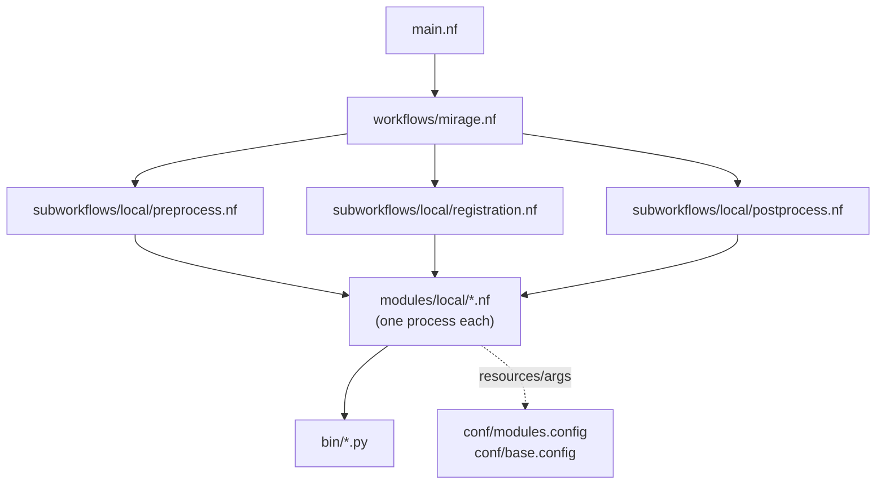
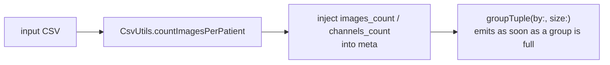
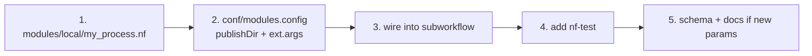
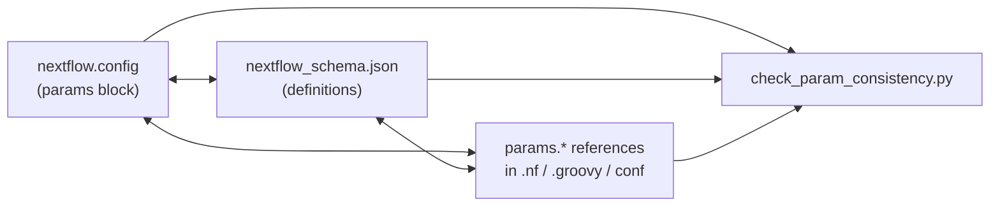

# Developer Guide

Welcome, contributor. MIRAGE is a Nextflow DSL2 pipeline with a small, consistent set of conventions: one process per file, the meta-map channel pattern, tool arguments in config, and a Python script shape shared across every `bin/` tool. Learn these once and the codebase becomes very predictable.

This guide covers the repository layout, the core channel pattern, the conventions you must follow, the Python script shape, how to add a new process, and how to keep the parameter surface in sync.

---

## Repository layout

```text
main.nf                          # Minimal entry point → calls the MIRAGE workflow
workflows/
  mirage.nf                      # Main workflow: step routing + QC aggregation
subworkflows/local/
  preprocess.nf                  # Image preprocessing
  registration.nf                # Image registration
  postprocess.nf                 # Segmentation, quantification, export
modules/local/                   # One process per file (UPPER_SNAKE_CASE)
lib/
  CsvUtils.groovy                # CSV parsing, metadata, patient counting
  ParamUtils.groovy              # Parameter validation helpers
bin/                             # Python tools called by processes
  utils/
    logger.py                    # Shared logging
    constants.py                 # Shared constants
    cli.py                       # Shared CLI helpers
conf/
  base.config                    # Resource labels, SLURM error handling
  modules.config                 # Per-process publishDir + ext.args
  test.config / test_full.config # Bundled datasets
  ieo.config                     # Site config (gitignored)
params/                          # Preset parameter files (test.json, full_pipeline.json, …)
nextflow.config                  # Profiles, params, manifest
nextflow_schema.json             # Parameter schema
tests/                           # Python unit tests + nf-test + validation scripts
```



The flow is strictly layered: `main.nf` is a thin entry point that calls the `MIRAGE` workflow in `workflows/mirage.nf`, which routes execution through the three subworkflows, each of which composes processes from `modules/local/`. Processes shell out to Python tools in `bin/`. Resources and tool arguments live in `conf/`, never inline.

---

## The meta-map and streaming `groupTuple` pattern

Every channel in MIRAGE carries a **`[meta, file(s)]`** tuple. `meta` is a Groovy map that travels alongside the data so processes know what they're handling without re-deriving it.

```groovy
// A typical channel element
[ [ id: 'P001_panel1',
    patient_id: 'P001',
    channel_name: 'DAPI',
    images_count: 2,
    channels_count: 4 ],
  file('/path/preprocessed.ome.tiff') ]
```

| Meta key | Meaning |
|---|---|
| `id` | Unique element identifier |
| `patient_id` | Patient / sample the element belongs to |
| `channel_name` | Channel name (when split per channel) |
| `images_count` | Number of images for this patient (pre-computed) |
| `channels_count` | Number of channels (pre-computed) |

### Why the counts matter

The pre-computed `images_count` / `channels_count` come from the CSV via `CsvUtils.countImagesPerPatient` and are injected into `meta` **up front**. This lets MIRAGE use a **streaming** `groupTuple` with an explicit `size:`:

```groovy
ch.groupTuple(by: { it[0].patient_id }, size: { it[0].images_count })
```



!!! info "Why streaming, not blocking?"
    A plain `groupTuple()` must wait for **every** upstream item before emitting any group. By telling it the exact group `size:` from the CSV, a patient's group can be released the instant its last image arrives — downstream work for early patients starts without waiting for the slowest sample. Preserve this: when you add a process that groups, derive the size from a meta count, don't drop it.

---

## Conventions

### Process template

Every process in `modules/local/` follows the same skeleton:

```groovy
process MY_PROCESS {
    tag   "$meta.id"
    label 'process_medium'
    container 'bolt3x/attend_image_analysis:preprocess'

    input:
    tuple val(meta), path(image)

    output:
    tuple val(meta), path("*.ome.tiff"), emit: image
    path "versions.yml",                 emit: versions

    script:
    def args = task.ext.args ?: ''
    """
    my_tool.py --input ${image} ${args} --output out.ome.tiff

    cat <<-END_VERSIONS > versions.yml
    "${task.process}":
        my_tool: \$(my_tool.py --version)
    END_VERSIONS
    """

    stub:
    """
    touch out.ome.tiff
    touch versions.yml
    """
}
```

Required elements:

- [x] `tag` — usually `"$meta.id"`, for readable trace/log output
- [x] `label` — a resource label from `conf/base.config` (`process_single`/`_low`/`_medium`/`_high`/`_long`/`_high_memory`)
- [x] `container` — an **immutable** tag, never `:latest`
- [x] meta-map in **and** out — `tuple val(meta), path(...)`
- [x] `versions.yml` emit — collected into the final QC report
- [x] a `stub:` block — so the stub run and nf-test stub suite work

### Other rules

| Rule | Why |
|---|---|
| **UPPER_SNAKE_CASE** process names, one per file | Predictable lookup; matches nf-core |
| **Args in `conf/modules.config`** via `ext.args` | Tunable without editing process scripts |
| **`publishDir` in `conf/modules.config`** | Output layout is config-driven |
| **Immutable container tags** | Reproducibility |
| **Resource labels, not hardcoded CPU/mem** | Scales with `task.attempt`, honours `--max_*` caps |
| **Every process emits `versions.yml`** | End-to-end provenance |

!!! tip "Put tool flags in config, not the script"
    A process script should describe *how the tool is wired*; the exact flags belong in `conf/modules.config`:

    ```groovy
    process {
        withName: MY_PROCESS {
            publishDir = [ path: { "${params.outdir}/${meta.patient_id}/my_process" }, mode: 'copy' ]
            ext.args   = '--threshold 0.5 --smooth'
        }
    }
    ```

---

## The Python script pattern

Tools in `bin/` share a consistent shape so they're testable in isolation (see [testing_guide.md](testing_guide.md)) and uniform to read:

```python
#!/usr/bin/env python3
from bin.utils.logger import get_logger
from bin.utils import constants, cli

log = get_logger(__name__)


def parse_args():
    parser = cli.base_parser(description="What this tool does")
    parser.add_argument("--input", required=True)
    parser.add_argument("--output", required=True)
    return parser.parse_args()


def main() -> int:
    args = parse_args()
    log.info("Processing %s", args.input)
    # ... real work ...
    return 0


if __name__ == "__main__":
    raise SystemExit(main())
```

| Element | Contract |
|---|---|
| `parse_args() -> argparse.Namespace` | All CLI parsing in one place |
| `main() -> int` | Returns a process exit code |
| `raise SystemExit(main())` | Propagates the exit code to the shell |
| `bin/utils/logger.py` | Shared structured logging — don't `print` |
| `bin/utils/constants.py` | Shared constants (channel names, defaults) |
| `bin/utils/cli.py` | Shared argument-parser helpers |

!!! note "Why this shape"
    Splitting `parse_args` from `main` lets unit tests call `main()` (or the underlying functions) directly with constructed arguments, without spawning a subprocess. That's how the `pytest` tier stays fast and container-free.

---

## Adding a new process — checklist



1. **Create `modules/local/my_process.nf`** using the process template above — `tag`, `label`, `container`, meta in/out, `versions.yml` emit, and a `stub:` block.
2. **Add `publishDir` and `ext.args`** for it in `conf/modules.config`.
3. **Include it in the relevant subworkflow** (`preprocess.nf`, `registration.nf`, or `postprocess.nf`) and wire its channels, preserving the meta-map and any `groupTuple` sizes.
4. **Add an nf-test** under `tests/modules/` (and a subworkflow test if it changes wiring).
5. **If you introduced a parameter**, update `nextflow.config`, `nextflow_schema.json`, and the docs, then run the consistency check (next section).

!!! example "Backing Python tool?"
    If the process calls a new `bin/` script, give it the `parse_args` / `main` shape, route logging through `bin/utils/logger.py`, and add a `pytest` under `tests/` so the logic is covered without containers.

---

## Keeping the parameter surface in sync

A parameter lives in **three** places that must agree:



When you add, rename, or remove a parameter:

1. Declare it (with a default) in the `params` block of **`nextflow.config`**.
2. Describe it in **`nextflow_schema.json`** (type, help text, group).
3. Reference it as `params.my_param` in the code that uses it.
4. Validate the three are aligned:

   ```bash
   python3 tests/check_param_consistency.py
   ```

The script flags mismatches between `nextflow.config` params and the schema, and confirms every `params.*` reference across `.nf`, `.groovy`, and `conf/*.config` is accounted for. Document user-facing params in [parameters.md](parameters.md).

---

## Running the test suite

All tiers — Python unit tests, the stub run, nf-test stub/real, param consistency, and lint — are documented with exact commands in the [testing guide](testing_guide.md). The fast loop before any push:

```bash
python tests/testdata/generate_complete_testdata.py
python3 tests/check_param_consistency.py
pytest -v tests/ --ignore=tests/testdata --ignore=tests/modules \
    --ignore=tests/subworkflows --ignore=tests/integration
nextflow run . -profile test,docker -stub --outdir results
```

---

## CI gates

Continuous integration (`.github/workflows/ci.yml`) mirrors the local tiers:

| Trigger | Runs |
|---|---|
| Every push / PR | Python tests (3.9–3.11), Nextflow stub (NF `25.04.0` + `latest-everything`), nf-test stub, `nf-core lint` (advisory) |
| Push to `main` / `dev` | The above **plus** nf-test real |
| Manual dispatch | nf-test integration |

!!! success "What must be green to merge"
    The **`all-tests`** gate requires **python-tests + nextflow-stub + nf-test-stub** to pass (lint is advisory). Run those three locally and you'll match the gate. See [testing_guide.md](testing_guide.md#the-ci-pipeline) for the full breakdown.

---

## Documentation (this site)

This site is built with **MkDocs + Material** (config: [`mkdocs.yml`](https://github.com/sceriff0/mirage/blob/main/mkdocs.yml)) and hosted on **Read the Docs**. Pages live in `docs/*.md`; pinned build deps are in `docs/requirements.txt`.

Build and preview locally:

```bash
pip install -r docs/requirements.txt
mkdocs serve            # live-reload preview at http://127.0.0.1:8000
mkdocs build --strict   # fail on broken internal links (what to run before pushing)
```

### How Read the Docs stays in sync with GitHub

Read the Docs **rebuilds automatically on every push** once the repository is
connected — you don't trigger builds manually. The wiring:

1. **Connect the repo once** (one-time, on the Read the Docs dashboard): *Import a
   Project* → pick `sceriff0/mirage`. This installs a GitHub **webhook** (or uses
   the Read the Docs GitHub App) that pings RTD on every push and merge.
2. **Each push** to the tracked branch (e.g. `main`) fires the webhook → RTD
   pulls the new commit, reads [`.readthedocs.yaml`](https://github.com/sceriff0/mirage/blob/main/.readthedocs.yaml), installs `docs/requirements.txt`, runs `mkdocs build`, and publishes — usually live within a couple of minutes.
3. **Pull-request previews** (optional, enable in *Settings → Advanced*): RTD
   builds the docs for each PR and posts a preview link, so doc changes are
   reviewable before merge.

!!! tip "Why `.readthedocs.yaml` unshallows the clone"
    The page "last updated" dates come from the `git-revision-date-localized`
    plugin, which needs full git history. Read the Docs clones shallow by default,
    so the config runs `git fetch --unshallow` in a `post_checkout` job. Leave that
    in place or the dates fall back to the build date.

!!! note "Catching doc breakage in CI"
    Read the Docs publishes but does not *gate* merges. To fail a PR on a broken
    internal link, add a job that runs `mkdocs build --strict` (it passes in CI
    because committed files have git history). This is optional and not currently
    wired into `ci.yml`.

---

## See also

<div class="grid cards" markdown>

-   :material-test-tube: **Testing guide**

    ---

    Every test tier, exact commands, and the CI gate.

    [:octicons-arrow-right-24: testing_guide.md](testing_guide.md)

-   :material-sitemap: **Workflow**

    ---

    How the steps route and what each subworkflow produces.

    [:octicons-arrow-right-24: workflow.md](workflow.md)

-   :material-tune: **Parameters**

    ---

    The user-facing parameter reference.

    [:octicons-arrow-right-24: parameters.md](parameters.md)

</div>
