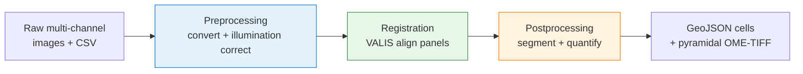

# Getting Started

Welcome to **MIRAGE** — a Nextflow DSL2 pipeline for multiplex whole-slide microscopy. You hand it raw multi-channel images and a small CSV samplesheet; it preprocesses them, registers panels onto a common reference, segments cells, quantifies per-cell marker intensities, and hands back QuPath-ready GeoJSON plus pyramidal OME-TIFFs. This page is your orientation map — read it, pick a path, and you'll have your first results in under 20 minutes.

!!! tip "First time here?"
    If you just want to *see it run*, jump straight to the [end-to-end Walkthrough](walkthrough.md). It uses bundled synthetic data and needs no real images, no GPU, and no HPC.

## Choose your path

<div class="grid cards" markdown>

- :material-download-box:{ .lg .middle } **Install MIRAGE**

    ---

    Set up Nextflow, Java, and a container backend, then clone the repo. Start here if nothing is installed yet.

    [Installation guide](installation.md)

- :material-play-circle:{ .lg .middle } **Run the Walkthrough**

    ---

    A guided, end-to-end run on synthetic test data — from clean clone to a populated results tree in ~10–20 min.

    [Walkthrough](walkthrough.md)

- :material-file-delimited:{ .lg .middle } **Prepare your input**

    ---

    Learn the samplesheet CSV schema and how to point MIRAGE at your own images and channels.

    [Input format](input_spec.md)

- :material-tune:{ .lg .middle } **Tune parameters**

    ---

    Every flag, its default, and what it does — including segmentation, registration, and memory knobs.

    [Parameters](parameters.md)

</div>

## The 30-second mental model

MIRAGE runs in **three stages**, always in this order. You choose where to enter and exit with `--start` and `--stop`.



- **Preprocessing** — Bio-Formats conversion + BaSiC illumination correction (+ optional QC).
- **Registration** — VALIS whole-slide registration onto the reference panel. (VALIS is the only registration method.)
- **Postprocessing** — segmentation + per-cell quantification + QuPath GeoJSON export + pyramidal OME-TIFF assembly + QC.

A stage runs **if and only if** its position falls within the `--start … --stop` window. Omit `--stop` and the pipeline runs to the end. Use `--start X --stop X` to run exactly one stage.

!!! info "No phenotyping stage"
    MIRAGE does not assign cell types. The exported GeoJSON carries **raw marker intensities plus z-scores**, so you do your gating/phenotyping downstream in QuPath or FlowPath.

## The minimal command

Run the whole pipeline on your own data:

```bash
nextflow run . \
  --input samplesheet.csv \
  --outdir results \
  -profile docker
```

`--input` and `--outdir` are **required** (there is no default outdir — it is created for you). `-profile` selects execution + container profiles — combine them with commas, e.g. `-profile slurm,singularity` on a cluster or `-profile test,docker` for the bundled demo.

!!! tip "Use a preset"
    Load a tuned parameter set with `-params-file`, e.g. `-params-file params/full_pipeline.json`. Anything passed on the command line overrides the preset.

## Running a single stage, or resuming a later one

Each stage writes a **checkpoint CSV** into one `csv/` folder directly under `--outdir` — aggregated across all patients, not in the per-patient `<outdir>/<patient_id>/csv/` subtree. Each file is a single CSV aggregating all patients. Feed one back in with a matching `--start` to resume.

```text
<outdir>/csv/preprocessed.csv     # written after preprocessing
<outdir>/csv/registered.csv       # written after registration
<outdir>/csv/postprocessed.csv    # written after postprocessing
```

=== "Single stage only"

    Run just one stage with `--start X --stop X`:

    ```bash
    # Only preprocessing
    nextflow run . --input samplesheet.csv --outdir results \
      --start preprocessing --stop preprocessing -profile docker
    ```

=== "Resume at registration"

    Feed the preprocessing checkpoint back in:

    ```bash
    nextflow run . --input results/csv/preprocessed.csv --outdir results \
      --start registration -profile docker -resume
    ```

=== "Resume at postprocessing"

    Feed the registration checkpoint back in:

    ```bash
    nextflow run . --input results/csv/registered.csv --outdir results \
      --start postprocessing -profile docker -resume
    ```

!!! note "`-resume` is your friend"
    `-resume` reuses cached tasks from previous runs, so re-running a tuned stage only recomputes what changed. See the [Restartability guide](restartability_guide.md) for the full pattern across all three entry points.

## Validate before you commit

Not sure your samplesheet is right? Do a dry run — it validates inputs and channel wiring without launching any real tasks:

```bash
nextflow run . --input samplesheet.csv --outdir results --dry_run true -profile docker
```

## First checks after launch

Once a run starts, here's how to confirm each stage actually produced something:

| After this stage | Look for | Where |
|---|---|---|
| Preprocessing | `<outdir>/csv/preprocessed.csv` | `<outdir>/csv/` |
| Registration | `registered/` (per patient) | `<outdir>/<patient_id>/registered/` |
| Postprocessing | `geojson/` and `pyramid/` (per patient) | `<outdir>/<patient_id>/` |

If the checkpoint CSV and per-patient folders are appearing, MIRAGE is doing its job. A full output tour lives in [Outputs](outputs.md).

## Next steps

- :material-play: New here? Do the [Walkthrough](walkthrough.md) first — it makes everything above concrete.
- :material-file-delimited: Bring your own data: [Input format](input_spec.md).
- :material-microscope: Pick a segmentation backend (`stardist`, `instantseg`, `cellsam`): [Segmentation](segmentation.md).
- :material-server: Move to a cluster: [SLURM guide](slurm.md).
- :material-lifebuoy: Hit a snag: [Troubleshooting](troubleshooting.md) and the [FAQ](faq.md).
