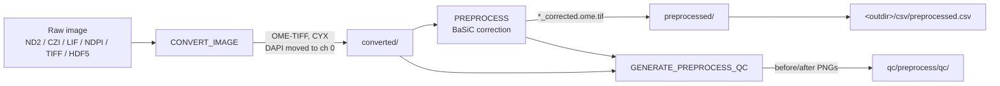
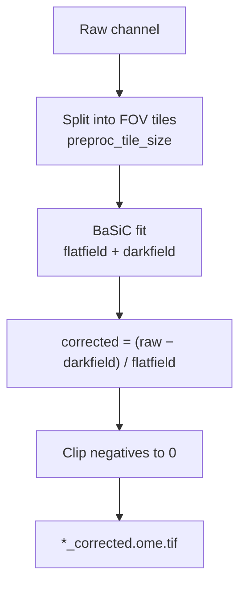

# Preprocessing

Preprocessing is the first of MIRAGE's three stages (preprocessing → registration → postprocessing). Its job is to take whatever raw microscopy you hand it and turn it into a clean, standardized, illumination-corrected stack that every downstream step can trust.

Two processes do the heavy lifting: **`CONVERT_IMAGE`** standardizes the file format and channel order, and **`PREPROCESS`** removes uneven illumination with BaSiC. A third process, **`GENERATE_PREPROCESS_QC`**, produces before/after visuals so you can confirm the correction did what you expected.

!!! info "Where this fits"
    Preprocessing runs when `--start preprocessing` (the default start). To run only this stage, use `--start preprocessing --stop preprocessing`. See [restartability_guide.md](restartability_guide.md) for the full stage-routing model and [workflow.md](workflow.md) for the pipeline overview.

<div class="grid cards" markdown>

-   :material-file-import: **Standardize**

    ---

    Any Bio-Formats image in, one OME-TIFF out — with DAPI guaranteed at channel 0.

-   :material-white-balance-iridescent: **Correct**

    ---

    BaSiC flatfield/darkfield illumination correction, tiled over FOVs, per channel.

-   :material-image-multiple: **Verify**

    ---

    Per-channel before/after PNGs land in `qc/preprocess/qc/`.

</div>

## Stage at a glance



The checkpoint CSV `<outdir>/csv/preprocessed.csv` is written to a single top-level `csv/` folder under `--outdir` and lists every patient's corrected images. You resume from it with:

```bash
nextflow run . \
  --input results/csv/preprocessed.csv \
  --start registration \
  --outdir results
```

---

## CONVERT_IMAGE — standardize the format

Microscopes speak many dialects. `CONVERT_IMAGE` reads them all through **bioio**/**tifffile** (Bio-Formats-compatible) and writes one predictable artifact: an OME-TIFF in **CYX** order.

It accepts:

| Format | Typical source |
| --- | --- |
| ND2 | Nikon |
| CZI | Zeiss |
| LIF | Leica |
| NDPI / NDPIS | Hamamatsu NanoZoomer |
| TIFF / OME-TIFF | generic / prior pipelines |
| HDF5 | array-based exports |

!!! important "DAPI is moved to channel 0"
    Registration and segmentation both assume the nuclear (DAPI) channel is first. `CONVERT_IMAGE` reorders the stack so **DAPI becomes channel 0**, regardless of where it sat in the raw file. Everything downstream relies on this invariant — don't bypass it.

Channel names are not guessed from the file; they come from the **`channels`** column of your samplesheet, pipe-separated, in acquisition order:

```csv
patient_id,image,channels,is_reference
P01,P01_panel1.nd2,DAPI|CD45|CD3|CD8,true
P01,P01_panel2.nd2,DAPI|PANCK|VIMENTIN|SMA,false
```

See [input_spec.md](input_spec.md) for the complete samplesheet contract.

!!! tip "Pixel size"
    The physical pixel size defaults to **0.325 µm** and is set with `--pixel_size`. It is carried into the OME metadata here and reused all the way through to micrometre conversions in [export.md](export.md). Set it once, correctly, for your scope.

- **Output:** `<outdir>/<patient_id>/converted/*.ome.tif`
- **Container:** `bolt3x/attend_image_analysis:convert_bioformats_2`

---

## PREPROCESS — BaSiC illumination correction

Wide-field and tiled acquisitions almost always carry uneven illumination: vignetting at FOV edges, a warm center, a slow gradient across the slide. `PREPROCESS` estimates and removes this with **BaSiC** (Background and Shading Correction), independently per channel.

BaSiC fits two fields:

- a **flatfield** — the multiplicative shading profile, and
- a **darkfield** — the additive background offset.

The corrected image is the raw image with the darkfield subtracted and the flatfield divided out. Correction is computed on **FOV-sized tiles** (`preproc_tile_size`) so the estimate matches the acquisition geometry rather than the full mosaic.



!!! warning "Negative values are clipped"
    After darkfield subtraction a few pixels can go slightly negative. These are **clipped to 0** before writing. This is expected and keeps intensities valid for the unsigned image types used downstream.

### Parameters

| Parameter | Default | What it does |
| --- | --- | --- |
| `preproc_tile_size` | `1950` | FOV tile size in pixels used to fit the correction. Match it to your acquisition FOV. |
| `preproc_skip_dapi` | `true` | Skip BaSiC on the DAPI channel. DAPI shading is usually mild and over-correction can harm segmentation. |
| `preproc_autotune` | `false` | Let BaSiC auto-tune its smoothing regularization instead of using fixed settings. |
| `preproc_n_iter` | `100` | Maximum BaSiC fitting iterations. |
| `preproc_pool_workers` | `3` | Channels processed in parallel; effective parallelism equals the process CPU count. |
| `preproc_overlap` | `0` | Overlap (px) between FOV tiles when fitting. |
| `preproc_no_darkfield` | `false` | Disable darkfield estimation (flatfield-only correction). |

??? note "Choosing `preproc_tile_size`"
    The tile should correspond to a single microscope FOV so that BaSiC sees one coherent illumination pattern per tile. If your mosaic was stitched from 2048×2048 FOVs, a tile near that size is a good starting point. Too large and you blur multiple illumination patterns together; too small and the fit becomes noisy.

??? note "When to flip `preproc_skip_dapi`"
    Keep DAPI skipped (the default) in most runs — nuclear signal is bright and fairly uniform, and BaSiC can introduce subtle artifacts that confuse segmentation. Set `--preproc_skip_dapi false` only if your DAPI channel shows clear, large-scale shading.

- **Output:** `<outdir>/<patient_id>/preprocessed/*_corrected.ome.tif`
- **Container:** `bolt3x/attend_image_analysis:preprocess`

!!! quote "BaSiC reference"
    BaSiC is described in Peng *et al.* 2017. See [citation.md](citation.md) for the full reference and how to cite MIRAGE's dependencies.

---

## Quality control

`GENERATE_PREPROCESS_QC` renders **per-channel before/after PNGs** so you can eyeball the correction at a glance — vignettes flattened, gradients removed, signal preserved.

=== "Run QC (default)"

    QC runs automatically. Thumbnails are downscaled for speed:

    ```bash
    nextflow run . \
      --input samplesheet.csv \
      --preprocess_qc_scale_factor 0.25 \
      --outdir results
    ```

=== "Skip QC"

    Skip the rendering step entirely on large cohorts where you only need the corrected images:

    ```bash
    nextflow run . \
      --input samplesheet.csv \
      --skip_preprocess_qc true \
      --outdir results
    ```

| Parameter | Default | Effect |
| --- | --- | --- |
| `skip_preprocess_qc` | `false` | Set `true` to skip the before/after rendering. |
| `preprocess_qc_scale_factor` | `0.25` | Downscale factor for QC thumbnails (smaller = faster, lower-res). |

- **Output:** `<outdir>/<patient_id>/qc/preprocess/qc/` (per-channel before/after PNGs)

These per-patient QC images are also rolled into the global HTML report at `<outdir>/qc/`. See [outputs.md](outputs.md) for the complete output map.

---

## Outputs recap

| Path | Produced by | Contents |
| --- | --- | --- |
| `<outdir>/<patient_id>/converted/` | CONVERT_IMAGE | Standardized OME-TIFF (CYX, DAPI at ch 0) |
| `<outdir>/<patient_id>/preprocessed/` | PREPROCESS | `*_corrected.ome.tif` |
| `<outdir>/<patient_id>/qc/preprocess/qc/` | GENERATE_PREPROCESS_QC | Before/after PNGs |
| `<outdir>/csv/preprocessed.csv` | stage checkpoint | One row per corrected image, all patients |

---

## Next steps

<div class="grid cards" markdown>

-   :material-arrow-right-circle: **Continue to registration**

    ---

    Align every panel to the reference coordinate space.

    [→ registration_methods.md](registration_methods.md)

-   :material-restore: **Resume from here**

    ---

    Restart a later stage from `<outdir>/csv/preprocessed.csv`.

    [→ restartability_guide.md](restartability_guide.md)

-   :material-tune: **All parameters**

    ---

    Full parameter reference, including every `preproc_*` flag.

    [→ parameters.md](parameters.md)

-   :material-help-circle: **Stuck?**

    ---

    Common preprocessing issues and fixes.

    [→ troubleshooting.md](troubleshooting.md)

</div>
