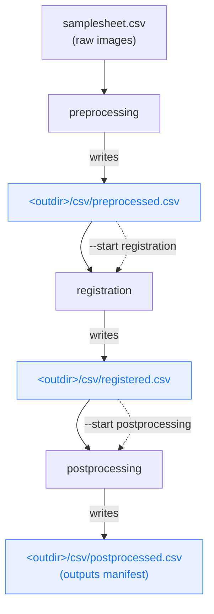

# Restartability & Checkpoints

MIRAGE is **checkpoint-driven**. Each stage writes an aggregated CSV describing its outputs, and that CSV is a valid `--input` for the next stage. This means you can stop after any stage, inspect the results, tune parameters, and resume — without re-running work you've already paid for.

!!! danger "Where checkpoints live"
    Checkpoint CSVs are written to one `csv/` folder directly under `--outdir`. They are **not** in the per-patient `<outdir>/<patient_id>/csv/` subtree — each is a single file aggregating **all** patients.

    Older docs incorrectly said `<outdir>/<patient>/csv/...` (or the launch directory). The correct paths are `<outdir>/csv/preprocessed.csv`, `<outdir>/csv/registered.csv`, `<outdir>/csv/postprocessed.csv`.

---

## The checkpoint model



Solid arrows are the normal end-to-end flow. Dotted arrows show how a checkpoint CSV becomes the `--input` for a later `--start`, letting you skip everything before it.

---

## Checkpoints at a glance

| Stage | Emits checkpoint | Columns | Resume the next stage with |
|---|---|---|---|
| preprocessing | `<outdir>/csv/preprocessed.csv` | `patient_id, preprocessed_image, is_reference, channels` | `--input <outdir>/csv/preprocessed.csv --start registration` |
| registration | `<outdir>/csv/registered.csv` | `patient_id, registered_image, is_reference, channels` | `--input <outdir>/csv/registered.csv --start postprocessing` |
| postprocessing | `<outdir>/csv/postprocessed.csv` | manifest: cell CSV, GeoJSON, merged CSV, cell mask, pyramid (per patient) | — (final stage) |

!!! info "`<outdir>/csv/postprocessed.csv` is a manifest, not a samplesheet"
    The `<outdir>/csv/postprocessed.csv` checkpoint records *what was produced* — one set of output artifacts per patient (cell CSV, GeoJSON, merged CSV, cell mask, OME-TIFF pyramid). It's for downstream consumption, not for re-entering the pipeline.

---

## Resume commands

=== "Resume at registration"

    Preprocessing already ran; start from its checkpoint.

    ```bash
    nextflow run main.nf \
      --input results/csv/preprocessed.csv \
      --outdir results \
      --start registration \
      -profile docker \
      -resume
    ```

=== "Resume at postprocessing"

    Registration already ran; start from its checkpoint.

    ```bash
    nextflow run main.nf \
      --input results/csv/registered.csv \
      --outdir results \
      --start postprocessing \
      -profile docker \
      -resume
    ```

=== "Single stage only"

    Run exactly one stage with `--start X --stop X`.

    ```bash
    nextflow run main.nf \
      --input results/csv/preprocessed.csv \
      --outdir results \
      --start registration --stop registration \
      -profile docker
    ```

---

## `-resume` vs `--start` — two different mechanisms

They're easy to confuse, but they do different things and **combine well**.

<div class="grid cards" markdown>

-   :material-cached:{ .lg .middle } **`-resume` (Nextflow work cache)**

    ---

    Reuses cached task results from the `work/` directory of a previous run. Nextflow hashes each task's inputs; unchanged tasks are skipped and their outputs reused. Re-running the *same* command with `-resume` picks up exactly where a crash left off.

    Scope: **within one run lineage**, task-level granularity.

-   :material-skip-next:{ .lg .middle } **`--start` (skip earlier stages)**

    ---

    Tells the pipeline to enter at a later stage by handing it a checkpoint CSV instead of raw images. Everything before that stage is never even scheduled.

    Scope: **stage-level**, driven by the checkpoint you feed to `--input`.

</div>

!!! example "They stack"
    Resume a registration run that crashed halfway: `--start registration` skips preprocessing, and `-resume` reuses any registration tasks that already completed.

    ```bash
    nextflow run main.nf \
      --input results/csv/preprocessed.csv \
      --outdir results \
      --start registration \
      -profile docker \
      -resume
    ```

---

## Re-running just postprocessing after tuning segmentation

A common loop: registration is good, but you want to try different segmentation settings. Re-run **only** postprocessing from the registration checkpoint, overriding the segmentation parameters inline.

```bash
nextflow run main.nf \
  --input results/csv/registered.csv \
  --outdir results \
  --start postprocessing --stop postprocessing \
  --seg_method instantseg \
  -profile docker
```

Change a parameter, re-run, compare outputs in `--outdir` — no preprocessing or registration is repeated. See [Parameters](parameters.md) for the segmentation knobs and [Outputs](outputs.md) for what to inspect.

---

## Gotchas

!!! warning "Read before you resume"
    - **Point `--input` at the checkpoint under `--outdir`.** Checkpoints live in `<outdir>/csv/`, in one `csv/` folder under your output root — not in the per-patient `<outdir>/<patient_id>/csv/` subtree. Use the matching `<outdir>/csv/...` path for `--input` when you resume.
    - **Keep `--outdir` consistent.** Checkpoint CSVs reference prior outputs by **absolute path**, and they live under `--outdir` themselves. If you point a later stage at a different `--outdir` (or move the results), those paths break. Use the same `--outdir` across stages.
    - **Don't move or rename the work directory** if you intend to `-resume` — the cache lives in `work/`.
    - **Checkpoints aggregate all patients.** One `<outdir>/csv/preprocessed.csv` covers every patient from the run; you don't assemble per-patient files.
    - **Editing a checkpoint is allowed.** It's a plain CSV with the columns the next stage needs — you can drop a patient or fix a path by hand. See [Input Format](input_spec.md).

---

## Related pages

- [Workflow](workflow.md) — what each stage does and produces.
- [CLI & Usage](usage.md) — the full flag reference and invocation patterns.
- [Input Format](input_spec.md) — checkpoint CSV columns per `--start`.
- [Outputs](outputs.md) — what each stage writes to `--outdir`.
