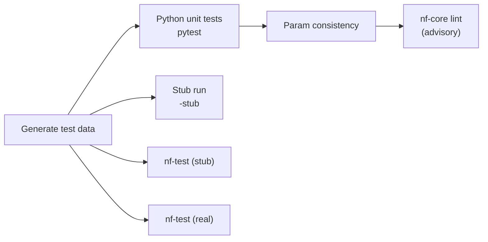
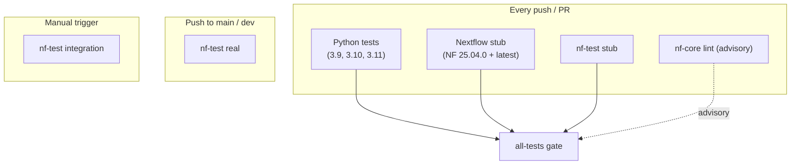

# Testing

MIRAGE ships several layers of tests, from millisecond-fast Python unit tests to full Nextflow runs against real containers. This guide explains each tier, the exact command to run it, what it validates, and how the same tiers map onto the CI pipeline.

!!! tip "The golden rule"
    Whatever you change, run the **fast** tiers locally before you push: Python unit tests, a stub run, and the param-consistency check. They mirror the gating CI jobs and catch the vast majority of regressions in seconds to a couple of minutes.

---

## Prerequisites: generate test data

Almost every tier needs synthetic test fixtures (small OME-TIFFs and matching CSVs). Generate them **once** before running anything:

```bash
python tests/testdata/generate_complete_testdata.py
```

!!! warning "Do this first"
    The stub run, nf-test, and many Python tests reference files produced by this script. If you skip it, you'll see missing-input or file-not-found errors that look like pipeline bugs but aren't. CI runs this step at the start of every job.

The script needs only `numpy` and `tifffile`:

```bash
pip install numpy tifffile
```

---

## The test tiers at a glance



| Tier | Command | Speed | Containers? |
|---|---|---|---|
| Python unit tests | `pytest ...` | seconds | no |
| Stub run | `nextflow run . -profile test,docker -stub ...` | ~1 min | no (stubs) |
| nf-test (stub) | `nf-test test --profile test,docker --verbose` | minutes | no (stubs) |
| nf-test (real) | `nf-test test --profile test,docker --tag real --verbose` | long | **yes** |
| Param consistency | `python3 tests/check_param_consistency.py` | seconds | no |
| Lint | `nf-core lint --dir .` | seconds | no |

---

## 1. Python unit tests

The Python tools in `bin/` are tested in isolation with `pytest`.

```bash
pytest -v tests/ \
    --ignore=tests/testdata \
    --ignore=tests/modules \
    --ignore=tests/subworkflows \
    --ignore=tests/integration
```

**What it validates:** argument parsing, image/CSV processing logic, and the helpers in `bin/utils/` — the pure-Python core of each process script, independent of Nextflow. The `--ignore` flags skip the data-generation script and the nf-test directories (which `pytest` cannot run).

!!! info "Coverage"
    CI adds `--cov=bin --cov-report=xml --cov-report=term-missing` to measure coverage of the `bin/` scripts. You can do the same locally if you have `pytest-cov` installed.

---

## 2. Stub run

A **stub** run executes the whole pipeline graph but replaces each process body with its `stub:` block — so it touches the real channel wiring, meta-map flow, and `groupTuple` logic without running any heavy tool or pulling a real container.

```bash
nextflow run . -profile test,docker -stub --outdir results
```

**What it validates:** the workflow connects end to end — step routing, channel cardinality, streaming `groupTuple` sizes, and that every process declares a working stub. This is the single fastest "does the DAG still hold together?" check, and it's exactly what CI runs.

---

## 3. nf-test — stub vs real

[nf-test](https://www.nf-test.com) is the Nextflow-native test framework. MIRAGE's nf-test files live in `tests/` — `tests/main.nf.test` (whole pipeline), `tests/subworkflows/` (e.g. registration), and `tests/modules/` (individual processes).

=== "Stub suite (fast, default)"

    Runs every nf-test in stub mode — no real containers, no heavy compute. This is the gating suite on every push/PR.

    ```bash
    nf-test test --profile test,docker --verbose
    ```

    **Validates:** each module/subworkflow's inputs, outputs, and channel shapes against snapshots, using stubbed process bodies.

=== "Real suite (slow, thorough)"

    Runs the tests tagged `real`, which execute the **actual** process scripts inside their containers against the synthetic data.

    ```bash
    nf-test test --profile test,docker --tag real --verbose
    ```

    **Validates:** the real tool invocations produce the expected outputs. Requires Docker and pulls real images, so it is much slower — CI only runs this on pushes to `main`/`dev`.

=== "Integration suite (manual)"

    The heaviest tier, tagged `integration`, exercises broader end-to-end scenarios. CI runs it only on a manual trigger.

    ```bash
    nf-test test --profile test,docker --tag integration --verbose
    ```

You can also target a single test file while iterating:

```bash
nf-test test tests/modules/quantify.nf.test --profile test,docker
```

---

## 4. Parameter consistency

MIRAGE keeps its parameter surface in three places — `nextflow.config`, `nextflow_schema.json`, and the `params.*` references scattered through code. A small script enforces they agree:

```bash
python3 tests/check_param_consistency.py
```

**What it validates:**

- the `params` keys declared in `nextflow.config` match `nextflow_schema.json`, and
- the `params.*` references used across `.nf`, `.groovy`, and `conf/*.config` are all accounted for.

Run this any time you add, rename, or remove a parameter. See [developer_guide.md](developer_guide.md#keeping-the-parameter-surface-in-sync) for the workflow.

---

## 5. Lint

```bash
nf-core lint --dir .
```

`nf-core lint` checks structure and best-practice conventions. It is **advisory** — in CI it never blocks a merge — but it's a useful nudge toward idiomatic Nextflow.

---

## Convenience scripts

Two shell wrappers bundle common sequences:

```bash
bash tests/run_tests.sh             # broad local test sequence
bash tests/run_validation_tests.sh  # pipeline validation checks (also run in CI's stub job)
```

---

## Recommended local workflows

=== "Quick smoke test"

    The minimum before pushing a small change — under two minutes, no real containers:

    ```bash
    python tests/testdata/generate_complete_testdata.py
    python3 tests/check_param_consistency.py
    pytest -v tests/ \
        --ignore=tests/testdata --ignore=tests/modules \
        --ignore=tests/subworkflows --ignore=tests/integration
    nextflow run . -profile test,docker -stub --outdir results
    ```

=== "Full local validation"

    Before a larger change or a release — adds the nf-test suites and lint:

    ```bash
    python tests/testdata/generate_complete_testdata.py
    python3 tests/check_param_consistency.py
    pytest -v tests/ \
        --ignore=tests/testdata --ignore=tests/modules \
        --ignore=tests/subworkflows --ignore=tests/integration
    nextflow run . -profile test,docker -stub --outdir results
    nf-test test --profile test,docker --verbose
    nf-test test --profile test,docker --tag real --verbose
    nf-core lint --dir .
    ```

---

## The CI pipeline

GitHub Actions (`.github/workflows/ci.yml`) runs the same tiers automatically:



| Trigger | Jobs that run |
|---|---|
| Every push / PR | Python tests, Nextflow stub (NF `25.04.0` **and** `latest-everything`), nf-test stub, `nf-core lint` |
| Push to `main` / `dev` | The above **plus** nf-test real |
| Manual (`workflow_dispatch`) | nf-test integration |

!!! success "The `all-tests` gate"
    A gate job named **`all-tests`** requires **python-tests + nextflow-stub + nf-test-stub** (plus the advisory lint) to succeed. If any of those fail, the gate fails — so green on those three locally means you're in good shape. `nf-test real` and `integration` run separately and are not part of the gate.

---

## Optional / heavy dependencies

Some Python tests touch code paths that import optional runtime packages — for example `valis`, `stardist`, `csbdeep`, and `basicpy`. These are **not** required to run the suite.

!!! note "Clean skips, not failures"
    Tests for those paths are written to **skip cleanly** when the dependency is unavailable, so you can run the full Python suite without installing the heavy scientific stack. You'll see `SKIPPED` markers rather than errors — that's expected, not a failure.

---

## See also

<div class="grid cards" markdown>

-   :material-account-wrench: **Developer guide**

    ---

    Repository layout, conventions, adding a process, and keeping params in sync.

    [:octicons-arrow-right-24: developer_guide.md](developer_guide.md)

-   :material-walk: **Walkthrough**

    ---

    A guided first run from samplesheet to GeoJSON output.

    [:octicons-arrow-right-24: walkthrough.md](walkthrough.md)

</div>
