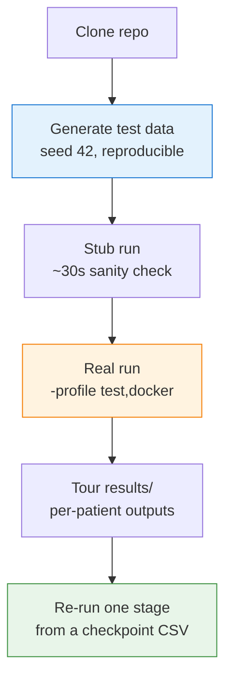

# End-to-End Walkthrough

This is the friendliest page on the site: it takes a brand-new user from a clean clone to a fully populated `results/` tree using the **bundled synthetic test data**. No real images, no GPU, no HPC required.

!!! success "What you'll have at the end"
    A complete per-patient results tree — registered images, segmented cells, per-cell quantification, a QuPath-ready GeoJSON, and a pyramidal OME-TIFF — produced entirely on your laptop's CPU.

!!! info "How long it takes"
    **Roughly 10–20 minutes** of wall time on a modern laptop, almost entirely spent in segmentation and quantification on CPU. Every timing on this page falls within that range.

Here's the whole journey at a glance:



## 0. Prerequisites

You will need:

- **Java 11+** — check with `java -version`
- **Nextflow `>=25.04.0`** — check with `nextflow -version` (see [Installation](installation.md) to upgrade)
- **Docker** — recommended for this walkthrough; Singularity also works (substitute `singularity` for `docker` in `-profile`)
- **Python 3.10+** with `numpy`, `tifffile`, `pandas` — used to synthesise the test data
- **~10 GB free disk** for containers and intermediate outputs

!!! tip "Nextflow too old?"
    If you already have Nextflow but it predates 25.04.0, just run `nextflow self-update`.

## 1. Clone the repository and generate test data

```bash
git clone https://github.com/sceriff0/mirage.git
cd mirage
python tests/testdata/generate_complete_testdata.py
```

The generator writes synthetic multi-channel OME-TIFFs and the matching samplesheet into `tests/testdata/`. It uses a **fixed seed (42)**, so two people running the same script get bit-identical fixtures — that's what makes the `test` profile reproducible across machines.

Verify the fixtures exist:

```bash
ls tests/testdata/test_input.csv tests/testdata/*.ome.tiff
```

??? note "What's in the test samplesheet?"
    `test_input.csv` describes one patient, `P001`, with a reference panel and one moving panel that share a DAPI channel:

    ```csv
    patient_id,path_to_file,is_reference,channels
    P001,.../P001_ref.ome.tiff,true,DAPI|PANCK|SMA
    P001,.../P001_mov1.ome.tiff,false,DAPI|CD3|CD8
    ```

    DAPI must be the first channel of every image — it's the shared anchor used for registration. See [Input format](input_spec.md) for the full schema.

## 2. Stub run — a 30-second sanity check

A **stub run** executes each process's `stub:` block (a placeholder that creates empty output files with the right names) instead of the real `script:` block. It validates that channels connect correctly and every process declares its expected outputs — without ever running the real tools.

```bash
nextflow run . -profile test,docker -stub --outdir results_stub
```

What to look for:

- A short DAG that finishes in **seconds, not minutes**
- Every process shows `cached` or `completed` — no `FAILED`
- `results_stub/` is created with the expected directory structure (placeholder files for every output)

!!! warning "If the stub fails, stop here"
    A failing stub means your *real* run will fail in the same place. Fix the wiring before moving on — it's much faster to debug at stub speed.

## 3. Real run on synthetic test data

```bash
nextflow run . -profile test,docker --outdir results
```

The `test` profile (in `conf/test.config`) wires everything up for you:

- Sets `--input` to `tests/testdata/test_input.csv` — no need to pass `--input`
- Caps resources: `max_cpus = 2`, `max_memory = 6.GB`, `max_time = 1.h`
- Sets `seg_gpu = false` so segmentation runs on CPU
- Shrinks tiling and feature counts and uses `memory_mode = 'low'` to keep the run small

The full three-stage pipeline (**preprocessing → registration → postprocessing**) runs. Watch the per-process progress in the Nextflow console.

!!! info "Where time goes"
    On a 4-core laptop expect **10–20 minutes**, with the bulk in the segmentation and quantification steps. Registration on this tiny synthetic data is quick.

!!! tip "First run is the slow one"
    The very first run also pulls container images. Pre-pull them (see [Installation](installation.md#pre-pulling-container-images-optional)) if you want the first run to fly.

## 4. Tour of `results/`

After a successful run you get a per-patient subtree. For the test data the patient ID is `P001`:

```text
results/
└── P001/
    ├── converted/         # Bio-Formats-converted OME-TIFFs
    ├── preprocessed/       # BaSiC illumination-corrected OME-TIFFs
    ├── registered/         # VALIS-registered OME-TIFFs
    │   └── summary/        # registration summary artifacts
    ├── cell_properties/    # per-cell morphology + contours from segmentation
    ├── quantification/     # per-cell marker intensity tables
    ├── geojson/
    │   ├── cells.geojson   # QuPath-importable cells (intensities + z-scores)
    │   └── cells_data.csv  # tabular per-cell data
    ├── pyramid/            # pyramidal OME-TIFF for QuPath / napari
    └── qc/                 # per-patient QC artifacts
```

And globally, alongside the patient folders:

```text
results/
├── qc/                     # aggregated HTML QC report across all patients
└── size_logs/              # input size logs (if trace is enabled)
```

!!! note "Where the checkpoint CSVs live"
    The stage checkpoint CSVs are in one `csv/` folder directly under `--outdir` (here, `results/`) — aggregated across all patients, **not** in the per-patient `results/<patient_id>/csv/` subtree:

    ```text
    results/csv/preprocessed.csv     # resume point for --start registration
    results/csv/registered.csv       # resume point for --start postprocessing
    results/csv/postprocessed.csv    # manifest of postprocessing outputs
    ```

    Each is a single file aggregating all patients — not per-patient.

Files worth opening:

- `results/P001/geojson/cells.geojson` — drop into [QuPath](https://qupath.github.io/) ("File → Import objects from file") to see segmented cells overlaid on the pyramid image. It carries raw marker intensities plus z-scores for downstream gating.
- `results/P001/geojson/cells_data.csv` — one row per cell: the canonical analysis table.
- `results/P001/pyramid/*.ome.tiff` — the multi-resolution image for visualisation.
- `results/P001/qc/` and `results/qc/` — visual sanity checks for preprocessing and registration.

See [Outputs](outputs.md) for the full column-level schema of every CSV and the GeoJSON property layout.

!!! question "No `phenotyping/` folder?"
    Correct — MIRAGE has no phenotyping stage. Cell typing happens downstream in QuPath/FlowPath using the intensities and z-scores already baked into `cells.geojson`.

## 5. Re-running a single stage

Each stage emits a checkpoint CSV in `<outdir>/csv/` that you can feed back into a later stage. Say you tuned a segmentation parameter and want to redo **only** postprocessing — without repeating preprocessing or registration:

```bash
nextflow run . \
  --input results/csv/registered.csv \
  --outdir results \
  --start postprocessing \
  -profile test,docker \
  -resume
```

`--start postprocessing` enters at the last stage, and `-resume` makes Nextflow reuse every cached upstream task — so only the work that actually changed is recomputed.

!!! tip "The general pattern"
    Resume registration with `--input results/csv/preprocessed.csv --start registration`, or postprocessing with `--input results/csv/registered.csv --start postprocessing`. See the [Restartability guide](restartability_guide.md) for all three entry points and the gotchas.

## 6. Next steps

<div class="grid cards" markdown>

- :material-tune:{ .lg .middle } **Tune parameters**

    ---

    On real data the highest-impact knobs are `--memory_mode`, `--feature_n_features`, the `--seg_*` segmentation settings, and your `--seg_method` backend.

    [Parameters](parameters.md) · [Segmentation](segmentation.md)

- :material-image-multiple:{ .lg .middle } **Run on real data**

    ---

    Swap in your own samplesheet and start from a tuned preset like `params/full_pipeline.json`.

    [Input format](input_spec.md)

- :material-server-network:{ .lg .middle } **Move to HPC**

    ---

    Use `-profile slurm,singularity` instead of `test,docker`, and configure partitions/QoS.

    [SLURM guide](slurm.md)

- :material-lifebuoy:{ .lg .middle } **Hit a snag?**

    ---

    Check common failures and fixes before filing an issue.

    [Troubleshooting](troubleshooting.md)

</div>
