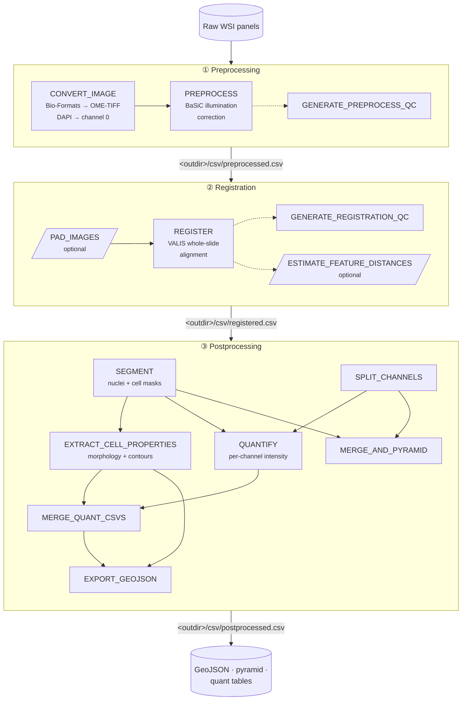
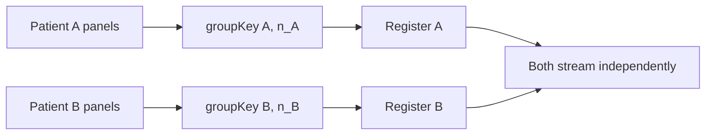

# Pipeline Architecture

MIRAGE is a [Nextflow DSL2](https://www.nextflow.io/) pipeline organized into
three restartable stages. This page is the map: how data flows, how stages are
selected, and how the pieces fit together. If you just want to run it, start
with the [Walkthrough](walkthrough.md); come back here when you want to know
*why* it's shaped this way.

## The three stages

<span class="stage-pill">preprocessing</span> &rarr;
<span class="stage-pill">registration</span> &rarr;
<span class="stage-pill">postprocessing</span>

Each stage consumes the previous stage's output and writes a **checkpoint CSV**
you can feed back in to resume. You control which stages run with `--start` and
`--stop`.



!!! info "Solid vs dashed"
    Solid arrows are the main data path. Dashed boxes are **optional** processes
    (QC and error estimation) that you can switch off — see
    [Parameters › Quality control](parameters.md#quality-control--reports).

## Step routing: `--start` and `--stop`

Both flags accept `preprocessing`, `registration`, or `postprocessing`. A stage
runs **if and only if** its position is within the `[start, stop]` window:

```groovy
// lib/ParamUtils.groovy
static final List STEP_ORDER = ['preprocessing', 'registration', 'postprocessing']

static boolean shouldRun(String targetStep, String start, String stop) {
    def idx = STEP_ORDER.indexOf(targetStep)
    return idx >= STEP_ORDER.indexOf(start) && idx <= STEP_ORDER.indexOf(stop)
}
```

| You want to… | Use |
|---|---|
| Run everything from raw images | `--start preprocessing` (default `--stop` = end) |
| Stop after registration | `--start preprocessing --stop registration` |
| Resume from a registration checkpoint | `--start registration --input <outdir>/csv/preprocessed.csv` |
| Run only postprocessing | `--start postprocessing --input <outdir>/csv/registered.csv` |
| Run a single stage in isolation | `--start X --stop X` |

If `--start` and `--stop` are inconsistent (e.g. stop *before* start), the
pipeline fails fast at launch with a clear message. See
[Restartability](restartability_guide.md) for the full resume patterns.

## What each stage does

=== "① Preprocessing"

    | Process | Role |
    |---|---|
    | `CONVERT_IMAGE` | Reads any Bio-Formats input, writes standardized OME-TIFF, moves **DAPI to channel 0** |
    | `PREPROCESS` | BaSiC flatfield/darkfield illumination correction, FOV-tiled |
    | `GENERATE_PREPROCESS_QC` | Per-channel before/after thumbnails *(optional)* |

    **Emits** `<outdir>/csv/preprocessed.csv`. Deep dive: [Preprocessing](preprocessing.md).

=== "② Registration"

    | Process | Role |
    |---|---|
    | `GET_IMAGE_DIMS` · `MAX_DIM` · `PAD_IMAGES` | Pad panels to a common canvas *(only if `--padding`)* |
    | `REGISTER` | VALIS rigid + non-rigid alignment of every panel to the patient's reference |
    | `GENERATE_REGISTRATION_QC` | RGB alignment overlays *(optional)* |
    | `ESTIMATE_FEATURE_DISTANCES` | Feature-based registration error *(only if `--enable_feature_error`)* |

    **Emits** `<outdir>/csv/registered.csv`. Deep dives:
    [Registration](registration_methods.md) ·
    [Error metrics](registration_errors.md) ·
    [Feature distances](estimate_feature_distances.md).

=== "③ Postprocessing"

    | Process | Role |
    |---|---|
    | `SEGMENT` | Nuclei + whole-cell masks (StarDist / InstanSeg / CellSAM) |
    | `EXTRACT_CELL_PROPERTIES` | Morphology table + simplified polygon contours (once per patient) |
    | `SPLIT_CHANNELS` | One single-channel TIFF per marker |
    | `QUANTIFY` | Per-cell intensity for each channel |
    | `MERGE_QUANT_CSVS` | Join all markers + morphology into one table |
    | `EXPORT_GEOJSON` | QuPath-native GeoJSON + z-scored CSV |
    | `MERGE_AND_PYRAMID` | Pyramidal OME-TIFF for visualization |
    | `GENERATE_POSTPROCESSING_QC` | Segmentation/intensity QC plots *(optional)* |

    **Emits** `<outdir>/csv/postprocessed.csv`. Deep dives:
    [Segmentation](segmentation.md) ·
    [Quantification](quantification.md) ·
    [Visualization & export](export.md).

## Core design patterns

### The meta-map

Every channel in the pipeline carries a `[meta, file(s)]` tuple. The `meta` map
is parsed from the samplesheet and enriched as data flows:

| Key | Set by | Purpose |
|---|---|---|
| `patient_id` | samplesheet | Groups all of a patient's panels |
| `is_reference` | samplesheet | Marks the registration target panel |
| `channels` | samplesheet | Ordered marker names for the image |
| `images_count` | input loader | Enables streaming `groupTuple` over a patient's panels |
| `channels_count` | input loader | Enables streaming `groupTuple` over a patient's channels |
| `id`, `channel_name` | postprocessing | Unique per-channel identity during quantification |

### Streaming `groupTuple`

Patient- and channel-level grouping uses `groupKey(key, count)` with counts
precomputed from the CSV. This lets Nextflow emit a group **as soon as its
expected members arrive**, instead of waiting for every sample in the run — so
patient A can be registering while patient B is still preprocessing.



### Reference-driven registration

Exactly one panel per patient is the **reference** (`is_reference = true`); all
other panels are warped into its coordinate space. If no reference is marked and
`--allow_auto_reference true`, the first panel is used. See
[Registration](registration_methods.md).

### Version tracking & QC aggregation

Every process emits a `versions.yml`. These are de-duplicated and collated into a
single file, and (unless `--skip_final_qc_report`) the QC PNGs, registration
summaries, and feature-distance JSONs from all stages are assembled into one
HTML report under `<outdir>/qc/`.

### Optional execution tracing

With `--enable_trace` (on by default) Nextflow writes `trace.txt`, `report.html`,
and `timeline.html` to `--trace_dir` (default `.trace`), and per-task input sizes
are aggregated to `<outdir>/size_logs/` for resource analysis.

## Repository layout

```text
main.nf                      # entry point → MIRAGE workflow
workflows/mirage.nf          # stage routing + QC aggregation
subworkflows/local/
  preprocess.nf              # ① preprocessing
  registration.nf            # ② registration
  postprocess.nf             # ③ postprocessing
modules/local/*.nf           # one process per file (UPPER_SNAKE_CASE)
lib/
  CsvUtils.groovy            # samplesheet parsing, counts, meta
  ParamUtils.groovy          # validation + step routing
conf/*.config                # base, modules, test, site profiles
bin/*.py                     # the Python tools each process runs
params/*.json                # parameter presets
```

Contributing? The [Developer Guide](developer_guide.md) walks through the process
template, the meta-map convention, and how to add a new module.

## Where to next

<div class="grid cards" markdown>

- :material-table:{ .lg .middle } **Describe your data** — [Samplesheet & input](input_spec.md)
- :material-folder-open:{ .lg .middle } **Find your results** — [Output files](outputs.md)
- :material-tune:{ .lg .middle } **Tune the knobs** — [Parameters](parameters.md)
- :material-restore:{ .lg .middle } **Resume a run** — [Restartability](restartability_guide.md)

</div>
