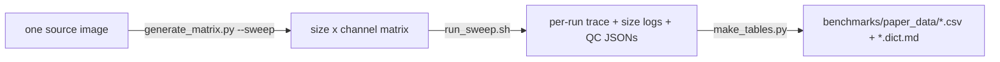

# Benchmarks & Performance

MIRAGE ships a self-contained benchmarking layer (`benchmarks/`) that produces the
**DATA** a method paper needs — tidy CSV tables, not plots — answering three
questions about the *shipped* pipeline (classic VALIS registration):

1. **How do resources scale with input size and parameters?** (peak RAM & wall-time laws)
2. **How accurate is registration?** (landmark-free, from the pipeline's own DAPI-nuclei QC)
3. **How stable is segmentation across backends?** (reference-free cross-method agreement)

!!! info "Where this lives"
    Everything is under `benchmarks/`, isolated from the production pipeline (it
    *runs* the pipeline; it is not part of its DAG). The design record is
    `docs/superpowers/specs/2026-07-24-benchmark-paper-data-design.md`; full run
    notes are in `benchmarks/README.md`.

!!! note "Distributed registration removed"
    Earlier versions benchmarked a distributed/tiled registration path. That path
    was archived out of the pipeline (git tag `archive/tiled-valis-2026-07-24`);
    registration is now classic `REGISTER` only, and the benchmark measures exactly
    what ships.

## The metrics come from the pipeline itself

The benchmark **invents no metrics** — it harvests QC the pipeline already emits:

| Table | Signal | Source (pipeline) |
|---|---|---|
| Resource scaling | peak RAM, wall-time vs input | Nextflow `trace.txt` + per-stage `size_logs` |
| Registration accuracy (segmentation-based) | `dice_matched` + centroid **displacement (µm)** per stage | `reg_qc=2` staged QC (`bin/warp_seg_qc.py`; see [Registration QC](registration_qc.md)) |
| Registration accuracy (VALIS-reported) | feature-based **rTRE / median distance (D)** per slide | the summary CSVs VALIS writes during `register()` (also shown in the final QC report) |
| Segmentation stability | cross-method `instance_f1` on the same image (reference-free) | pairwise mask IoU between `segmentation_grid` runs |

The benchmark harvests **two independent registration-accuracy signals**: the
segmentation-based Dice/displacement above, and VALIS's *own* feature-based rTRE (the
error `registrar.register()` reports). Having both — one geometric on nuclei, one on
VALIS's feature matches — is a stronger claim than either alone. The VALIS rTRE also
appears in the pipeline's final HTML QC report ("Registration Accuracy (Valis rTRE)").

Registration accuracy is landmark-free: the staged QC segments DAPI nuclei, fixes
cell-to-cell correspondence **once** at the rigid stage, then re-measures the same
pairs after each transform. The Δ-vs-rigid displacement isolates the registration
effect from segmentation noise — that is the number to quote, alongside
`dice_matched`.

## The data flow



## The DATA deliverable — `benchmarks/paper_data/`

`make_tables.py` writes tidy CSVs, each with a sibling `*.dict.md` data dictionary:

| File | One row per | Headline columns |
|---|---|---|
| `runs_master.csv` | run | `<stage>_peak_ram_gb`, `<stage>_wall_s`, `cpu_hours`, `gpu_hours` |
| `scaling_fits.csv` | (stage, metric) | `slope`, `intercept`, `r2` for `peak_rss_gb ~ input_gb` and `realtime_s ~ input_gb` |
| `registration_accuracy.csv` | (run, moving, stage) | `dice_matched`, `displacement_um_p50`, `delta_disp_um_p50_vs_rigid` |
| `registration_valis_rtre.csv` | (run, slide) | VALIS-reported `non_rigid_D` / rTRE (feature-based) |
| `segmentation_agreement.csv` | method pair | `instance_f1` (reference-free cross-method stability) |
| `param_matrix.csv` | run | `runs_master` joined with both registration-accuracy headlines — tune from here |

The scaling fit is **linear**: `slope` is the marginal cost per input GiB and
`intercept` the fixed overhead (physically interpretable for capacity planning),
with `r2` the fit quality.

## How to run it

```bash
# 0. verify the harness locally, no data needed
python -m pytest benchmarks/tests -q

# 1. build the synthetic input matrix straight from the sweep (derives sizes,
#    channels, --paired and the moving-panel count automatically)
python benchmarks/generate_matrix.py \
    --source /path/to/your_source.ome.tif \
    --outdir bench_matrix \
    --sweep benchmarks/configs/sweep.yaml

# 2. expand the sweep into a run plan (3 replicates per config for a variance estimate)
python benchmarks/build_run_plan.py \
    --sweep benchmarks/configs/sweep.yaml \
    --out bench_run_plan.csv --repeats 3

# 3. run the sweep on the cluster — one pipeline launch per row, reg_qc=2 on.
#    Positional args: <run_plan> <matrix_manifest> <results_root>. Requires bash 4+.
#    Parallelism: export SWEEP_CONCURRENCY=N to keep N runs in flight.
benchmarks/run_sweep.sh bench_run_plan.csv bench_matrix/matrix_manifest.csv bench_runs

# 4. emit the paper DATA locally from the completed runs
python -m benchmarks.analysis.make_tables \
    --results-root bench_runs \
    --run-plan bench_run_plan.csv \
    --manifest bench_matrix/matrix_manifest.csv \
    --outdir benchmarks/paper_data
```

Step 4 is safe to run mid-sweep: runs without a completed `out/` tree are skipped
(their rows simply don't appear yet), so you can watch the tables fill in.

!!! note "Registration must actually run"
    `generate_matrix.py --sweep` emits a reference + moving panel per patient
    (distinct channel names) so VALIS registration — and therefore the registration
    QC — genuinely runs. A single-slide matrix makes registration a passthrough
    no-op and leaves `registration_accuracy.csv` empty.

## Optional: figures and the derived config

`make_tables.py` is the DATA path. If you also want plots and the auto-derived
`conf/modules.optimized.config` (a memory model with an additive-σ retry buffer),
run the figure path on the same results:

```bash
python -m benchmarks.analysis.make_figures \
    --results-root bench_runs --run-plan bench_run_plan.csv \
    --manifest bench_matrix/matrix_manifest.csv --outdir benchmarks/analysis
```

The derived config is written separately and never overwrites the live one —
diff `conf/modules.config` against `conf/modules.optimized.config` and adopt
deliberately. The emitted closures are bare `.GB` expressions: this repo has no
`check_max()` helper — the top-level `process.resourceLimits` closure in
`nextflow.config` already clamps every request to `--max_cpus/--max_memory/--max_time`.
