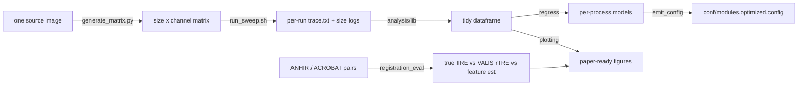

# Benchmarks & Performance

MIRAGE ships a self-contained benchmarking layer (`benchmarks/`) that answers two
practical questions: **how do resources scale with input size and parameters?**
and **how accurate is registration — tiled vs classic?** The same harness also
*derives* an optimised `modules.config` from the measured scaling.

!!! info "Where this lives"
    Everything is under `benchmarks/`, isolated from the production pipeline (it
    runs the pipeline; it is not part of its DAG). See the design spec and the
    `benchmarks/README.md` for the full run instructions.

## What gets measured



- **Resource sweep** — one image is rescaled across a size axis and a channel
  axis, and the pipeline is run once per cell (and per swept parameter), with
  Nextflow tracing on. Each run yields `trace.txt` (peak RSS, runtime, CPU, and
  I/O volume via `rchar`/`wchar`) and a `size_logs/input_sizes.csv`.
- **Parameter sweep** — registration/segmentation/quantification knobs that move
  cost are varied one-factor-at-a-time (`benchmarks/configs/sweep.yaml`).
- **Registration accuracy** — VALIS registration with in-process tiling **on vs
  off** is scored against ANHIR/ACROBAT landmark ground truth, reporting three
  views: true landmark **TRE/rTRE/µm**, VALIS's self-reported **rTRE**, and a
  **feature-distance** estimate, with bootstrap confidence intervals.

## Reproducing the figures

```bash
# 1. build the input matrix from your own source image
# --paired emits a reference+moving panel per cell (n_channels>=2) so registration axes are exercised
python benchmarks/generate_matrix.py --source /path/to/source.ome.tif --outdir bench_matrix --paired
# 2. expand the parameter sweep into a run plan
python benchmarks/build_run_plan.py --sweep benchmarks/configs/sweep.yaml --out bench_run_plan.csv
# 3. run the sweep (per-run trace + size logs)
benchmarks/run_sweep.sh bench_run_plan.csv bench_matrix/matrix_manifest.csv bench_results
# 4. analyse: figures + the optimised config
python -m benchmarks.analysis.make_figures \
    --results-root bench_results --run-plan bench_run_plan.csv \
    --manifest bench_matrix/matrix_manifest.csv
# 5. (optional) render web PNGs into this page's image slots
python -m benchmarks.analysis.export_docs_figures \
    --results-root bench_results --run-plan bench_run_plan.csv \
    --manifest bench_matrix/matrix_manifest.csv
```

!!! note "Registration in the resource sweep"
    When `--paired` is used with `generate_matrix.py`, `run_sweep.sh` emits a
    reference+moving panel per patient (distinct channel names: reference uses
    `DAPI|ch1|…`, moving uses `DAPI|m1|…`), so VALIS registration actually runs and
    the registration parameter axes (`memory_mode`, `reg_*`) are exercised. Without
    `--paired`, each run contains a single slide and registration is a passthrough
    no-op, making those axes meaningless.

The interactive notebook `benchmarks/analysis/benchmark_analysis.ipynb` walks the
same five sections (load → regression → optimal config → tiled-vs-classic →
sampling) with inline plots.

## Resource scaling

<!-- Populate via step 5 above, then uncomment (one per process you care about):
<figure markdown>
  
  <figcaption>Per-process peak RSS vs input size, with the fitted line.</figcaption>
</figure>
-->

Each process gets a linear fit of `peak_rss ~ input_gb` (plus residual σ). The
slope tells you how memory grows with input; σ feeds the retry buffer below.

## Registration accuracy — tiled vs classic

<!-- Populate from the registration-accuracy harness (benchmarks/registration_eval):
<figure markdown>
  
  <figcaption>True landmark rTRE, in-process tiling on vs off, across pairs.</figcaption>
</figure>
-->

The evaluator compares the two modes on identical pairs and runs a paired
bootstrap test, so a difference is reported with a confidence interval rather than
a single number. See [Registration Error Metrics](registration_errors.md) for how
rTRE and the feature-distance estimate are defined.

## How the optimal `modules.config` is derived

The regression turns each per-process fit into a memory directive with an
**additive-σ retry buffer** that matches MIRAGE's `task.attempt` scaling:

```groovy
withName: 'SEGMENT' {
    memory = { check_max( ( (merged_file.size() >> 30) * slope + intercept + sigma * task.attempt ).GB, 'memory' ) }
}
```

- `slope * input_gb + intercept` is the fitted expected peak.
- `sigma * task.attempt` adds one residual-σ of headroom per retry, so a task that
  is unlucky on attempt 1 gets progressively more memory instead of failing
  repeatedly at the same ceiling.
- Fits with low R² are flagged `LOW CONFIDENCE` for manual review.

The emitter writes a **separate** `conf/modules.optimized.config` — it never
overwrites the live config. Diff it and adopt deliberately:

```bash
# written by step 4 above (make_figures)
diff conf/modules.config conf/modules.optimized.config
```

!!! warning "Review before adopting"
    The optimised config is only as good as the runs behind it. Benchmark on
    inputs representative of your real data, check the `LOW CONFIDENCE` flags, and
    keep `check_max` so values stay within `--max_memory`.
