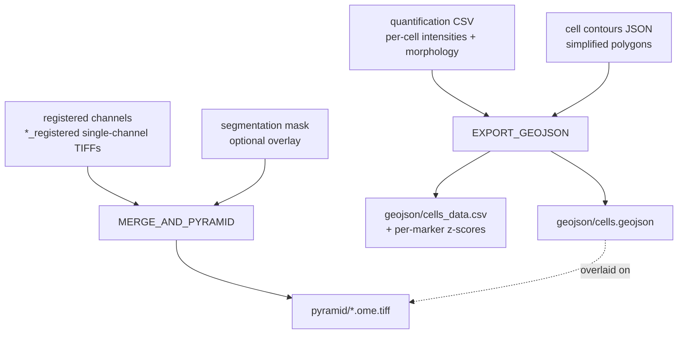

# Visualization & Export

This is the end of the line. After segmentation and quantification have turned pixels into a table of cells, the export stage produces the two artifacts you actually open and explore:

<div class="grid cards" markdown>

-   :material-vector-polygon: **`geojson/cells.geojson`**

    ---

    A QuPath-native FeatureCollection — one polygon per cell, with raw marker intensities and morphology baked in as measurements. Produced by `EXPORT_GEOJSON`.

-   :material-layers-triple: **`pyramid/*.ome.tiff`**

    ---

    A tiled, multi-resolution OME-TIFF of all registered channels (plus an optional segmentation overlay). Produced by `MERGE_AND_PYRAMID`.

</div>

Open the pyramid as your image and import the GeoJSON as objects on top of it — that's the whole visualization workflow.

!!! info "Where this fits"
    These are the final outputs of the **postprocessing** stage. See [outputs.md](outputs.md) for the complete output tree, [segmentation.md](segmentation.md) for the masks that feed this stage, and [quantification.md](quantification.md) for the per-cell measurement table that becomes the GeoJSON.

---

## How the two artifacts are built



The GeoJSON and the pyramid are independent products built from the same upstream run — the geometry comes from the quantification table and contours, the image comes from the registered channels.

---

## The GeoJSON

`EXPORT_GEOJSON` writes a GeoJSON **FeatureCollection**. Every cell is a single `Feature`:

```json
{
  "type": "Feature",
  "id": "PathDetectionObject",
  "geometry": {
    "type": "Polygon",
    "coordinates": [[[1024.5, 768.5], [1025.5, 768.5], "..."]]
  },
  "properties": {
    "objectType": "detection",
    "classification": { "name": "Cell", "colorRGB": -16711681 },
    "isLocked": false,
    "measurements": [
      { "name": "Centroid X µm", "value": 333.16 },
      { "name": "Centroid Y µm", "value": 249.76 },
      { "name": "CD8", "value": 412.5 },
      { "name": "Area µm²", "value": 84.21 }
    ]
  }
}
```

Key properties:

- **`objectType: "detection"`** — QuPath treats each feature as a detection object.
- **`classification: {name: "Cell"}`** — all cells share the single class `Cell` (in cyan). There is no phenotype label here (see the warning below).
- **`geometry`** — a **Polygon** built from the simplified cell contours. If a cell has no contour, it falls back to a **Point** at the centroid.

### The measurements array

Measurements are stored as a **QuPath-native array** of `{name, value}` objects — exactly the shape QuPath serializes itself, so they appear in the measurement table on import with no remapping.

| Measurement | Unit | Notes |
| --- | --- | --- |
| `Centroid X µm`, `Centroid Y µm` | µm | Cell centroid |
| *each marker* | raw intensity | One entry per channel; plus compartment columns when per-compartment quantification is enabled |
| `Area µm²` | µm² | |
| `Perimeter µm` | µm | |
| `Convex Area µm²` | µm² | |
| `Major Axis Length µm` | µm | |
| `Minor Axis Length µm` | µm | |
| `Eccentricity` | — | Dimensionless |
| `Solidity` | — | Dimensionless |

Lengths and areas are converted from pixels using **`--pixel_size`** (default `0.325` µm): lengths multiply by the pixel size, areas multiply by its square. Dimensionless ratios are passed through unchanged.

!!! note "Coordinate convention"
    Coordinates are in **pixels** with a **+0.5 corner-of-pixel offset**, matching the convention used by the contour extraction so polygons and centroids line up with QuPath/ImageJ. The pixel→µm conversion (`--pixel_size`) is applied to the *measurements*, while the geometry stays in pixel space.

### The companion CSV

`geojson/cells_data.csv` carries the same per-cell rows as a flat table and, on top of the raw intensities, adds a **per-marker z-score** column for each marker (e.g. `CD8_zscore`). This is the convenient form for scripted analysis outside QuPath.

!!! danger "There is no phenotyping step in MIRAGE"
    MIRAGE deliberately stops at **raw, un-gated measurements**. Every cell is class `Cell`; no thresholds are applied, no cell types are assigned. **Gating and phenotyping happen downstream in QuPath / FlowPath**, where you set thresholds interactively against the actual intensity distributions of your run. The GeoJSON is the hand-off point — it gives the downstream tools everything they need to gate, and nothing they'd have to undo.

---

## The pyramid OME-TIFF

`MERGE_AND_PYRAMID` merges all of a patient's registered single-channel images into one **tiled, multi-resolution** OME-TIFF, optionally appending the segmentation mask as an extra channel. The pyramid structure is what lets QuPath, napari, and OMERO pan and zoom a multi-gigabyte image smoothly.

| Parameter | Default | What it does |
| --- | --- | --- |
| `tilex` | `512` | Tile width (px). |
| `tiley` | `512` | Tile height (px). |
| `pyramid_resolutions` | `8` | Number of resolution levels. |
| `pyramid_scale` | `2` | Downscale factor between successive levels. |
| `compression` | `zstd` | `zstd`, `lzw`, `zlib`, `jpeg`, or `none`. |
| `pixel_size` | `0.325` | Physical pixel size (µm) written to OME metadata. |

- **Output:** `<outdir>/<patient_id>/pyramid/*.ome.tiff`
- **Container:** `bolt3x/attend_image_analysis:merge`

=== "Default (zstd)"

    Fast to decompress in QuPath, good ratio — the recommended default.

    ```bash
    nextflow run . \
      --input csv/registered.csv \
      --start postprocessing \
      --compression zstd \
      --outdir results
    ```

=== "LZW"

    Broadly compatible, lossless:

    ```bash
    --compression lzw
    ```

=== "Uncompressed"

    Largest files, fastest reads:

    ```bash
    --compression none
    ```

!!! tip "Tiles and resolutions"
    The defaults (512×512 tiles, 8 levels, scale 2) suit typical WSI viewers. Keep tiles a power of two and matched to your viewer's cache; add resolution levels for very large slides so the lowest-zoom overview stays light.

---

## Loading in QuPath

!!! example "Open the pyramid and overlay the cells"
    1. **Open the image.** In QuPath, drag in `pyramid/<patient>.ome.tiff` (or *File → Open*). It loads as a multi-channel pyramidal image; channel names and colors come from the OME metadata.
    2. **Import the objects.** *File → Import objects from file…* and select `geojson/cells.geojson`. The cell polygons appear overlaid on the image, all classified as `Cell`.
    3. **Inspect measurements.** Open the measurement table — each cell carries its centroid, raw marker intensities, and morphology in µm, ready to sort and visualize.
    4. **Gate.** Use QuPath / **FlowPath** to threshold markers and assign phenotypes interactively. This is where cell typing happens — MIRAGE intentionally leaves it to you.

The same artifacts work in **napari** (open the OME-TIFF, load the GeoJSON as a shapes/points layer) and **OMERO** (import the pyramid; attach the GeoJSON). Because the pyramid is a standards-compliant OME-TIFF and the GeoJSON is QuPath-native, no conversion is needed.

---

## Outputs recap

| Path | Produced by | Contents |
| --- | --- | --- |
| `<outdir>/<patient_id>/geojson/cells.geojson` | EXPORT_GEOJSON | QuPath-native FeatureCollection |
| `<outdir>/<patient_id>/geojson/cells_data.csv` | EXPORT_GEOJSON | Flat table + per-marker z-scores |
| `<outdir>/<patient_id>/pyramid/*.ome.tiff` | MERGE_AND_PYRAMID | Tiled multi-resolution OME-TIFF |

See [outputs.md](outputs.md) for how these sit alongside `cell_properties/`, `quantification/`, and the per-patient `qc/` directory.

---

## Next steps

<div class="grid cards" markdown>

-   :material-grid: **Segmentation**

    ---

    Where the masks and contours come from.

    [→ segmentation.md](segmentation.md)

-   :material-table: **Quantification**

    ---

    The per-cell measurement table behind the GeoJSON.

    [→ quantification.md](quantification.md)

-   :material-folder-multiple: **All outputs**

    ---

    The complete per-patient and global output tree.

    [→ outputs.md](outputs.md)

-   :material-tune: **All parameters**

    ---

    Every `pyramid_*`, tile, and compression flag.

    [→ parameters.md](parameters.md)

</div>
