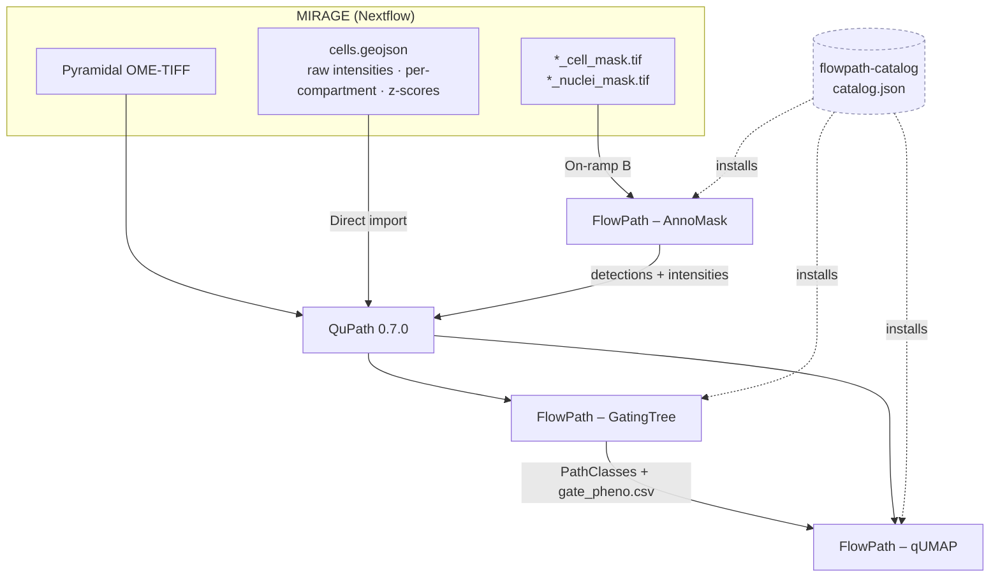

# The FlowPath Ecosystem

MIRAGE deliberately stops at **quantified cells**. It hands you a pyramidal OME-TIFF and a QuPath-native `cells.geojson` — every cell with its raw marker intensities, optional per-compartment measurements, and z-scores — and then gets out of the way. It does **not** phenotype your cells for you.

That last mile — *gating, phenotyping, and interactive exploration* — is exactly what the **FlowPath** suite is for. FlowPath is a family of [QuPath](https://qupath.github.io/) 0.7.0 extensions that pick up MIRAGE's output and turn it into living, clickable biology: hierarchical gates, named populations, and UMAP embeddings you can lasso.

!!! info "Where MIRAGE ends and FlowPath begins"
    See [export.md](export.md) for how the `cells.geojson` is produced and [quantification.md](quantification.md) for the measurement keys it contains. Everything on this page happens *after* MIRAGE finishes, inside QuPath.

<!--  -->

## How it all fits together

MIRAGE runs as a Nextflow pipeline and emits two artifacts. FlowPath gives you **two on-ramps** to get those into QuPath, then two analysis tools to work with them. The catalog is simply how you *install* the extensions.



!!! note "Two on-ramps, your choice"
    **(A)** Open the OME-TIFF in QuPath and import `cells.geojson` directly — the fastest path, since MIRAGE already did the quantification.
    **(B)** Skip MIRAGE's GeoJSON export and bring the label masks (`*_cell_mask.tif` / `*_nuclei_mask.tif`) into QuPath via **AnnoMask**, which re-derives identical intensities in-app.

## Install the suite

All three extensions ship through a single QuPath **extension catalog** — think of it as FlowPath's app store. Add one URL and QuPath will offer to install (and later update) every extension for you.

!!! tip "Add the catalog (recommended)"
    In QuPath:

    **Extensions → Manage extensions → Manage extension catalogs → Add catalog →**

    ```
    https://raw.githubusercontent.com/sceriff0/flowpath-catalog/main/catalog.json
    ```

    Then install **GatingTree**, **AnnoMask**, and **qUMAP** from the catalog list. The catalog itself is the distribution hub — it is *not* part of the data flow.

    Repo: <https://github.com/sceriff0/flowpath-catalog>

Prefer to do it by hand? Two alternatives:

=== "Drop in a JAR"

    Download the release `.jar` for the extension you want from its GitHub Releases page and drop it into QuPath's **extensions directory** (Extensions → Manage extensions shows the path). Restart QuPath.

=== "Build from source"

    Clone the extension repo and build the JAR yourself:

    ```bash
    git clone https://github.com/sceriff0/qupath-extension-flowpath-gatingtree
    cd qupath-extension-flowpath-gatingtree
    ./gradlew build
    ```

    The built JAR lands under `build/libs/`; copy it into QuPath's extensions directory.

!!! info "Compatibility"
    Every FlowPath extension targets **QuPath 0.7.0** and is **MIT-licensed**, authored by GitHub user [`sceriff0`](https://github.com/sceriff0).

## The four components

<div class="grid cards" markdown>

-   :material-store:{ .lg .middle } **flowpath-catalog**

    ---

    The suite's "app store" index — a `catalog.json` served from GitHub. Add it once in QuPath and install all three extensions from one place. It's the install hub, not a step in the data flow.

    [:octicons-arrow-right-24: Repo](https://github.com/sceriff0/flowpath-catalog)

-   :material-file-tree:{ .lg .middle } **FlowPath – GatingTree**

    ---

    Interactive, tree-based **cell phenotyping**. The primary consumer of MIRAGE's `cells.geojson`. Build hierarchical marker gates, watch cells recolor live, and export per-cell phenotypes.

    [:octicons-arrow-right-24: Repo](https://github.com/sceriff0/qupath-extension-flowpath-gatingtree)

-   :material-image-filter-center-focus:{ .lg .middle } **FlowPath – AnnoMask**

    ---

    Turns a **labeled segmentation mask into QuPath detections** in-app, optionally sampling per-channel intensities identical to MIRAGE's. The alternative on-ramp for MIRAGE's label masks.

    [:octicons-arrow-right-24: Repo](https://github.com/sceriff0/qupath-extension-annomask)

-   :material-scatter-plot:{ .lg .middle } **FlowPath – qUMAP**

    ---

    **UMAP** dimensionality reduction and visualization of cell measurements. Embed all markers in 2D, color by phenotype, and lasso populations in embedding space.

    [:octicons-arrow-right-24: Repo](https://github.com/sceriff0/qupath-extension-flowpath-qumap)

</div>

### The three extensions in detail

=== "GatingTree"

    **FlowPath – GatingTree** (folder `qupath-extension-flowpath`, latest installable ~v1.9.1) is interactive, **tree-based cell phenotyping**. Build a hierarchy of marker gates — for example `CD45+` → `CD3+` → `CD8+` = *"T cytotoxic"* — and every cell flows down the tree into a named phenotype.

    Its README puts it plainly: GatingTree is *"designed to work with the mirage pipeline … from raw images to cell phenotypes."*

    **What it does**

    - Live **1D histograms** with draggable thresholds and **2D scatter / quadrant / polygon** gates
    - **Real-time cell recoloring** as you move thresholds
    - **Raw / Z-score** toggle (the Z-score uses MIRAGE's own z-scores)
    - **QC pre-filters**: area, eccentricity, solidity, intensity, perimeter
    - **Outlier clipping**, plus **undo / redo**
    - Per-gate choice of **compartment** (Nucleus / Cytoplasm / Cell) and **statistic** (Mean / Median / Sum)

    | | |
    |---|---|
    | **Launch** | Extensions → FlowPath - GatingTree (`Ctrl+G`) |
    | **Reads from MIRAGE** | `cells.geojson` — per-compartment keys (`marker: Compartment: Statistic`) and z-scores |
    | **Writes** | `flowpath.json` (gate hierarchy) · `gate_pheno.csv` (per-cell phenotype + per-marker ± status) |
    | **Repo** | <https://github.com/sceriff0/qupath-extension-flowpath-gatingtree> |

    !!! success "Native to MIRAGE's measurements"
        GatingTree natively understands MIRAGE's per-compartment keys and falls back to whole-cell / Mean for legacy data — so you pick compartment and statistic per gate without any reformatting.

=== "AnnoMask"

    **FlowPath – AnnoMask** (folder `qupath-extension-annomask`, latest ~v0.3.4) converts a **labeled segmentation mask into QuPath detection objects / GeoJSON** entirely in-app — no need to run MIRAGE's `export_geojson.py`.

    It's the **alternative on-ramp**: bring MIRAGE's `*_cell_mask.tif` or `*_nuclei_mask.tif` straight into QuPath.

    **What it does**

    - Reads a labeled mask and emits one detection per label
    - Optionally **samples per-channel mean intensity** per detection using the *same bincount as MIRAGE's `bin/quantify.py`* — **the values are identical**
    - Keys intensities by **bare channel name** (e.g. `CD45`, `DAPI`), so the output is interchangeable with MIRAGE's GeoJSON
    - Also handles **Cellpose / StarDist** masks

    | | |
    |---|---|
    | **Launch** | Extensions → FlowPath - AnnoMask (`Ctrl+Shift+M`) |
    | **Reads from MIRAGE** | `*_cell_mask.tif` / `*_nuclei_mask.tif` (plus the OME-TIFF for intensity sampling) |
    | **Writes** | QuPath detection objects / GeoJSON with bare-channel intensities |
    | **Repo** | <https://github.com/sceriff0/qupath-extension-annomask> |

    !!! note "Interchangeable output"
        Because AnnoMask reuses the exact bincount from MIRAGE's quantification, a GeoJSON it produces is plug-compatible with one MIRAGE wrote — see [segmentation.md](segmentation.md) for the mask outputs it consumes.

=== "qUMAP"

    **FlowPath – qUMAP** (folder `qupath-extension-qumap`, latest ~v0.10.1) brings **UMAP dimensionality reduction and visualization** to your cell measurements (UMAP via the [SMILE](https://haifengl.github.io/) library).

    **What it does**

    - Computes a **2D UMAP** from all markers
    - **Colors cells by phenotype / PathClass** — e.g. the classes GatingTree assigned
    - **Interactive polygon selection** in embedding space
    - **Persistent population tagging** as PathClasses
    - **Marker-expression overlays** (z-score or raw)
    - **Stratified subsampling** for large slides

    | | |
    |---|---|
    | **Launch** | Extensions → FlowPath - qUMAP (`Ctrl+U`) |
    | **Reads from MIRAGE** | cell measurements + PathClasses (mirrors GatingTree's compartment / statistic model for feature selection) |
    | **Writes** | `umap_coordinates.csv` |
    | **Repo** | <https://github.com/sceriff0/qupath-extension-flowpath-qumap> |

    !!! tip "Better together"
        Gate first in GatingTree to assign PathClasses, then color the qUMAP by those classes to see whether your gates form coherent islands in embedding space.

</div>

## Why the measurement keys line up

This is the quiet superpower of the integration. MIRAGE and FlowPath agree on a naming contract, so nothing needs to be reshaped between them.

!!! tip "Plug-and-play measurement keys"
    MIRAGE writes measurements under two key conventions:

    - **Bare marker** — e.g. `CD45`, `DAPI` (whole-cell mean, the AnnoMask convention)
    - **Per-compartment** — `"<MARKER>: <Compartment>: <Statistic>"`, e.g. `CD3: Nucleus: Mean`

    GatingTree and qUMAP read **exactly those keys**, letting you pick compartment (Nucleus / Cytoplasm / Cell) and statistic (Mean / Median / Sum) per gate or feature. For older data without per-compartment keys, they **fall back to whole-cell / Mean** automatically.

    The result: MIRAGE's output is **plug-and-play** in FlowPath — no renaming, no remapping, no CSV surgery.

For the full list of keys MIRAGE emits, see [quantification.md](quantification.md) and [outputs.md](outputs.md).

## Typical workflow

1. **Run MIRAGE** through postprocessing to produce the pyramidal OME-TIFF and `cells.geojson` (see the [walkthrough.md](walkthrough.md)).
2. **Open the OME-TIFF** in QuPath 0.7.0.
3. **Import the cells** — either import `cells.geojson` directly (on-ramp A), or bring in `*_cell_mask.tif` via **AnnoMask** (on-ramp B).
4. **Gate and phenotype** in **GatingTree** (`Ctrl+G`) → cells get PathClasses, and you export `gate_pheno.csv` + `flowpath.json`.
5. **Explore** in **qUMAP** (`Ctrl+U`) → embed all markers, color by the GatingTree PathClasses, lasso populations, and export `umap_coordinates.csv`.

---

Ready to produce the inputs? Head back to [export.md](export.md) to see exactly what MIRAGE hands off, or [index.md](index.md) for the big picture.

!!! note "Separate repos, same author"
    FlowPath is **not** part of the MIRAGE repository. Its components are independent, **MIT-licensed** QuPath extensions maintained by [`sceriff0`](https://github.com/sceriff0). If you use them in published work, please cite both MIRAGE (see [citation.md](citation.md)) and the relevant FlowPath repositories.
