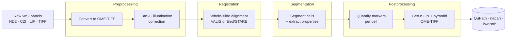

---
hide:
  - navigation
  - toc
---

<div class="mirage-hero" markdown>

<div class="kick">Multiplex Imaging Registration, Analysis &amp; GeoJSON Export</div>

# MIRAGE

A Nextflow DSL2 pipeline that takes raw whole-slide microscopy from many panels
and turns it into aligned images, segmented cells, single-cell marker tables, and
QuPath-ready GeoJSON — reproducibly, on your laptop or an HPC cluster.

<div class="mirage-badges" markdown>
[:material-rocket-launch: Install](installation.md){ .md-button .md-button--primary }
[:material-walk: How to use](usage.md){ .md-button }
[:material-sitemap: The pipeline](pipeline.md){ .md-button }
[:fontawesome-brands-github: Source](https://github.com/sceriff0/mirage){ .md-button }
</div>

</div>

[](https://www.nextflow.io/)
[](https://www.docker.com/)
[](https://sylabs.io/docs/)
[](https://github.com/sceriff0/mirage/blob/main/LICENSE)

## What MIRAGE does

MIRAGE is built for **multiplex fluorescence imaging**, where each tissue sample
is imaged across several panels of markers. It stitches those panels into one
coordinate space, finds every cell, measures every marker, and hands you
analysis-ready tables and QuPath-native overlays.



The four stages — **preprocessing → registration → segmentation → postprocessing** — run in that
order and are independently restartable, so you can re-run just the part you're
tuning. By default MIRAGE **stops at quantified cells** — the exported GeoJSON carries
raw marker intensities, and you gate/phenotype downstream in QuPath or the
[FlowPath](https://flowpath.readthedocs.io/) ecosystem.

## Highlights

- **Any Bio-Formats input** — reads ND2, CZI, LIF, NDPI, TIFF, HDF5 and more,
  normalizes to OME-TIFF, and moves the configured nuclear marker
  (`params.nuclear_markers`, default `DAPI`/`CELLTOX`) to channel 0.
- **Two registration backends** — **VALIS** (default, deep-feature rigid + non-rigid
  alignment) or **tiled/STARE** (JVM-free, fully parallel), both aligning every panel
  to a shared reference with quantitative error metrics.
- **Three segmentation backends** — swap between **StarDist**, **InstanSeg**, and
  **CellSAM** with a single `--seg_method` flag.
- **Single-cell quantification** — per-cell marker intensities, optional
  nucleus / cytoplasm / cell compartments, and morphology.
- **QuPath-native export** — GeoJSON with raw intensities and z-scores, plus a
  pyramidal OME-TIFF for interactive viewing and gating.
- **Restartable & HPC-ready** — checkpoint CSVs between stages, SLURM/Singularity
  profiles, and resource-aware retries.

## A 30-second taste

```bash
# 1. Clone and generate the bundled synthetic test data
git clone https://github.com/sceriff0/mirage.git && cd mirage
python tests/testdata/generate_complete_testdata.py

# 2. Run the whole pipeline on the test data (CPU, ~15 min)
nextflow run . -profile test,docker --outdir results
```

That's the full preprocessing → registration → segmentation → postprocessing run. [Usage](usage.md)
tours every file it produces.

## Get started

<div class="grid cards" markdown>

-   :material-download:{ .lg .middle } **Install**

    ---

    Nextflow, a container runtime, and a clone of the repo. You're five minutes
    from your first run.

    [:octicons-arrow-right-24: Installation](installation.md)

-   :material-walk:{ .lg .middle } **Run it**

    ---

    The four-stage model, the samplesheet, resuming from checkpoints, and what
    lands in `--outdir`.

    [:octicons-arrow-right-24: Usage](usage.md)

-   :material-tune:{ .lg .middle } **Tune it**

    ---

    All 75 parameters, grouped by stage, with defaults and guidance.

    [:octicons-arrow-right-24: Parameters](parameters.md)

-   :material-sitemap:{ .lg .middle } **The pipeline**

    ---

    Every process in execution order, its defaults, and the two registration
    backends — the site rendering of Supplementary Figure S1.

    [:octicons-arrow-right-24: Pipeline](pipeline.md)

-   :material-image-multiple:{ .lg .middle } **Supplementary figures**

    ---

    Three self-contained figures — S1 the whole pipeline,
    [S2 registration](figures/registration-schematic.html){ target=_blank },
    [S3 quality control](figures/qc-schematic.html){ target=_blank }.

    [:octicons-arrow-right-24: S1 · pipeline](figures/pipeline-schematic.html){ target=_blank }

-   :material-file-tree:{ .lg .middle } **Inputs & outputs**

    ---

    The samplesheet contract per entry point, the checkpoint CSVs, the full
    published tree, and the measurement-key grammar.

    [:octicons-arrow-right-24: Inputs & outputs](outputs.md)

-   :material-server:{ .lg .middle } **Resources**

    ---

    What each process asks the scheduler for, how it grows on a retry, what
    clamps it, and which container it runs in.

    [:octicons-arrow-right-24: Resources](resources.md)

</div>

!!! note "Source of truth"
    When the docs and the code disagree, the code wins —
    [`nextflow.config`](https://github.com/sceriff0/mirage/blob/main/nextflow.config)
    holds parameter defaults and
    [`nextflow_schema.json`](https://github.com/sceriff0/mirage/blob/main/nextflow_schema.json)
    the schema. Please [open an issue](https://github.com/sceriff0/mirage/issues)
    if you spot a mismatch. Found MIRAGE useful? See [Citation](citation.md).
