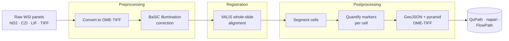

---
hide:
  - navigation
  - toc
---

<div class="mirage-hero" markdown>

# MIRAGE

**Multiplex Imaging Registration, Analysis, & GeoJSON Export**

A Nextflow DSL2 pipeline that takes raw whole-slide microscopy from many
panels and turns it into aligned images, segmented cells, single-cell marker
tables, and QuPath-ready GeoJSON — reproducibly, on your laptop or an HPC
cluster.

<div class="mirage-badges" markdown>
[:material-rocket-launch: Get started](getting_started.md){ .md-button .md-button--primary }
[:material-walk: Run the walkthrough](walkthrough.md){ .md-button }
[:fontawesome-brands-github: Source](https://github.com/sceriff0/mirage){ .md-button }
</div>

</div>

[](https://www.nextflow.io/)
[](https://www.docker.com/)
[](https://sylabs.io/docs/)
[](https://github.com/sceriff0/mirage/blob/main/LICENSE)

## What MIRAGE does

MIRAGE is built for **multiplex fluorescence imaging**, where each tissue
sample is imaged across several panels of markers. It stitches those panels
into one coordinate space, finds every cell, measures every marker, and hands
you analysis-ready tables and overlays.



The three stages — **preprocessing → registration → postprocessing** — are
independently restartable, so you can re-run just the part you're tuning. See
[Pipeline Architecture](workflow.md) for the full data flow.

## Choose your path

<div class="grid cards" markdown>

-   :material-download:{ .lg .middle } **Install**

    ---

    Nextflow, a container runtime, and a clone of the repo. You're five minutes
    from your first run.

    [:octicons-arrow-right-24: Installation](installation.md)

-   :material-walk:{ .lg .middle } **Walkthrough**

    ---

    Clone → generate synthetic test data → a full end-to-end run in ~15 minutes,
    no GPU required.

    [:octicons-arrow-right-24: End-to-end walkthrough](walkthrough.md)

-   :material-table:{ .lg .middle } **Prepare your data**

    ---

    A CSV samplesheet describes your panels. Learn the columns and the
    one-reference-per-patient rule.

    [:octicons-arrow-right-24: Samplesheet & input](input_spec.md)

-   :material-tune:{ .lg .middle } **Tune it**

    ---

    Every flag, grouped by stage, with defaults and guidance — from tile sizes
    to segmentation backends.

    [:octicons-arrow-right-24: Parameters](parameters.md)

</div>

## Highlights

<div class="grid cards" markdown>

-   :material-image-multiple:{ .lg .middle } **Any Bio-Formats input**

    ---

    Reads ND2, CZI, LIF, NDPI, TIFF, HDF5 and more, normalizes to OME-TIFF, and
    guarantees DAPI lands on channel 0.

-   :material-vector-link:{ .lg .middle } **VALIS registration**

    ---

    Deep-feature rigid + non-rigid alignment of every panel to a shared
    reference, with quantitative error metrics.

    [:octicons-arrow-right-24: Registration](registration_methods.md)

-   :material-grain:{ .lg .middle } **Three segmentation backends**

    ---

    Swap between **StarDist**, **InstanSeg**, and **CellSAM** with a single
    `--seg_method` flag.

    [:octicons-arrow-right-24: Segmentation](segmentation.md)

-   :material-chart-scatter-plot:{ .lg .middle } **Single-cell quantification**

    ---

    Per-cell marker intensities, optional nucleus / cytoplasm / cell
    compartments, and morphology.

    [:octicons-arrow-right-24: Quantification](quantification.md)

-   :material-shape-outline:{ .lg .middle } **QuPath-native export**

    ---

    GeoJSON with raw intensities and z-scores, plus a pyramidal OME-TIFF for
    interactive viewing and gating.

    [:octicons-arrow-right-24: Visualization & export](export.md)

-   :material-restore:{ .lg .middle } **Restartable & HPC-ready**

    ---

    Checkpoint CSVs between stages, SLURM/Singularity profiles, and
    resource-aware retries.

    [:octicons-arrow-right-24: Restartability](restartability_guide.md)

</div>

## A 30-second taste

```bash
# 1. Clone and generate the bundled synthetic test data
git clone https://github.com/sceriff0/mirage.git && cd mirage
python tests/testdata/generate_complete_testdata.py

# 2. Run the whole pipeline on the test data (CPU, ~15 min)
nextflow run . -profile test,docker --outdir results
```

That's the full preprocessing → registration → postprocessing run. The
[walkthrough](walkthrough.md) tours every file it produces.

!!! tip "New here? Read in this order"
    1. [Installation](installation.md) — get the tools in place
    2. [Walkthrough](walkthrough.md) — see a real run end to end
    3. [Samplesheet & Input](input_spec.md) — describe your own data
    4. [Pipeline Architecture](workflow.md) — understand the flow
    5. [Parameters](parameters.md) — tune it for your samples

## Source of truth

When the docs and the code disagree, the code wins — please
[open an issue](https://github.com/sceriff0/mirage/issues) so we can fix the docs.

| Surface | File |
|---|---|
| Pipeline entrypoint | [`main.nf`](https://github.com/sceriff0/mirage/blob/main/main.nf) |
| Parameter defaults | [`nextflow.config`](https://github.com/sceriff0/mirage/blob/main/nextflow.config) |
| Parameter schema | [`nextflow_schema.json`](https://github.com/sceriff0/mirage/blob/main/nextflow_schema.json) |
| Validation rules | [`lib/ParamUtils.groovy`](https://github.com/sceriff0/mirage/blob/main/lib/ParamUtils.groovy) |

Found MIRAGE useful in your research? See [Citation](citation.md).
