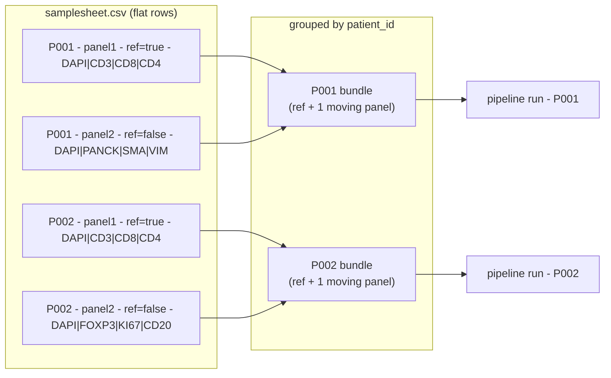

# Samplesheet & Input Format

MIRAGE is driven by a single **CSV manifest** passed with `--input`. Every row describes one image (one acquisition panel). Rows are grouped by `patient_id`, and each patient is processed independently — and in parallel — through the pipeline.

The required columns change depending on *where you enter the pipeline* (`--start`), because each stage consumes a different kind of image. This page covers all three entry points, the validation rules, and a few practical tips.

!!! tip "TL;DR"
    - One row per image. Group rows by `patient_id`.
    - Exactly **one** `is_reference=true` row per patient.
    - `channels` is pipe-separated, in acquisition order, and **must include DAPI**.
    - The column that points to the image depends on `--start`: `path_to_file` → `preprocessed_image` → `registered_image`.
    - You rarely write the registration/postprocessing samplesheets by hand — earlier stages emit them for you under `csv/`. See [Restartability & Checkpoints](restartability_guide.md).

---

## How rows become work

A samplesheet is a flat list of images, but MIRAGE treats it as a set of per-patient bundles. All rows sharing a `patient_id` are gathered together; the `is_reference=true` row defines the coordinate space that every other panel for that patient is registered into.



---

## Entry point: `--start preprocessing`

This is the default and most common entry point: raw, uncorrected images straight off the scanner.

| Column | Required | Description |
|---|:---:|---|
| `patient_id` | yes | Unique patient/sample identifier. Rows sharing this value are grouped. |
| `path_to_file` | yes | Absolute path to the raw image. Any Bio-Formats / OME-readable format (`.nd2`, `.czi`, `.ome.tif`, ...). |
| `is_reference` | yes | `true` for the reference panel, `false` for every other panel. Exactly one `true` per patient. |
| `channels` | yes | Pipe-separated channel names in acquisition order, e.g. `DAPI|CD3|CD8|CD4`. Must contain DAPI. |

=== "Single patient, two panels"

    ```csv
    patient_id,path_to_file,is_reference,channels
    P001,/data/raw/P001_panel1.nd2,true,DAPI|CD3|CD8|CD4
    P001,/data/raw/P001_panel2.nd2,false,DAPI|PANCK|SMA|VIMENTIN
    ```

=== "Multi-patient, multi-panel"

    ```csv
    patient_id,path_to_file,is_reference,channels
    P001,/data/raw/P001_panel1.nd2,true,DAPI|CD3|CD8|CD4
    P001,/data/raw/P001_panel2.nd2,false,DAPI|PANCK|SMA|VIMENTIN
    P002,/data/raw/P002_panel1.czi,true,DAPI|CD3|CD8|CD4
    P002,/data/raw/P002_panel2.czi,false,DAPI|FOXP3|KI67|CD20
    P002,/data/raw/P002_panel3.czi,false,DAPI|CD68|CD163|HLADR
    ```

!!! info "What preprocessing does to DAPI"
    `CONVERT_IMAGE` moves the DAPI channel to **channel 0** regardless of where you list it in `channels`. The DAPI check is **case-insensitive** (`dapi`, `DAPI`, `Dapi` all pass), so you can keep your original acquisition naming.

---

## Entry point: `--start registration`

Start here when your images are already illumination-corrected (the output of preprocessing). The only difference from the preprocessing samplesheet is the image column: `preprocessed_image` instead of `path_to_file`.

| Column | Required | Description |
|---|:---:|---|
| `patient_id` | yes | Unique patient/sample identifier. |
| `preprocessed_image` | yes | Absolute path to the illumination-corrected OME-TIFF. |
| `is_reference` | yes | `true` for the reference panel. Exactly one `true` per patient. |
| `channels` | yes | Pipe-separated channel names in acquisition order. Must contain DAPI. |

```csv
patient_id,preprocessed_image,is_reference,channels
P001,/abs/path/preprocessed/P001_panel1_corrected.ome.tif,true,DAPI|CD3|CD8|CD4
P001,/abs/path/preprocessed/P001_panel2_corrected.ome.tif,false,DAPI|PANCK|SMA|VIMENTIN
P002,/abs/path/preprocessed/P002_panel1_corrected.ome.tif,true,DAPI|CD3|CD8|CD4
P002,/abs/path/preprocessed/P002_panel2_corrected.ome.tif,false,DAPI|FOXP3|KI67|CD20
```

!!! success "You don't have to build this by hand"
    Preprocessing writes exactly this file to **`csv/preprocessed.csv`** in your launch directory, aggregating every patient. Point `--input` straight at it. See [Restartability & Checkpoints](restartability_guide.md).

---

## Entry point: `--start postprocessing`

Start here when registration is already done and you want segmentation, quantification, and export — for example after tuning segmentation parameters. The image column is `registered_image`.

| Column | Required | Description |
|---|:---:|---|
| `patient_id` | yes | Unique patient/sample identifier. |
| `registered_image` | yes | Absolute path to the registered OME-TIFF. |
| `is_reference` | yes | `true` for the reference panel. Exactly one `true` per patient. |
| `channels` | yes | Pipe-separated channel names in acquisition order. Must contain DAPI. |

```csv
patient_id,registered_image,is_reference,channels
P001,/abs/path/registered/P001_panel1_registered.ome.tiff,true,DAPI|CD3|CD8|CD4
P001,/abs/path/registered/P001_panel2_registered.ome.tiff,false,DAPI|PANCK|SMA|VIMENTIN
P002,/abs/path/registered/P002_panel1_registered.ome.tiff,true,DAPI|CD3|CD8|CD4
P002,/abs/path/registered/P002_panel2_registered.ome.tiff,false,DAPI|FOXP3|KI67|CD20
```

!!! success "Generated for you"
    Registration writes **`csv/registered.csv`** in your launch directory — a ready-made postprocessing samplesheet for all patients. See [Restartability & Checkpoints](restartability_guide.md).

---

## Field semantics

<div class="grid cards" markdown>

-   :material-star-circle:{ .lg .middle } **`is_reference`**

    ---

    A boolean (`true` / `false`). The `true` row is the **reference panel** — its coordinate space is the registration target. Every other panel for that patient is warped onto it.

    Exactly **one** `true` per patient. Zero or two will fail validation.

-   :material-format-list-numbered:{ .lg .middle } **`channels`**

    ---

    Pipe-separated names in **acquisition order**: `DAPI|CD3|CD8|CD4`. Order must match the physical channel order in the image, because downstream tools index channels by position.

    Validated to be non-empty with no blank entries.

-   :material-dna:{ .lg .middle } **DAPI requirement**

    ---

    `DAPI` must appear in `channels` (checked **case-insensitively**). It is the nuclear stain that drives segmentation. `CONVERT_IMAGE` relocates it to channel 0.

-   :material-account-group:{ .lg .middle } **`patient_id` grouping**

    ---

    The grouping key. All rows with the same `patient_id` form one bundle (reference + moving panels). Different patients are fully independent and run in parallel.

</div>

---

## Validation rules

!!! warning "Checked at launch (see `lib/CsvUtils.groovy` and `lib/ParamUtils.groovy`)"
    - **Required columns must exist** for the chosen `--start`:
        - `preprocessing` -> `patient_id, path_to_file, is_reference, channels`
        - `registration` -> `patient_id, preprocessed_image, is_reference, channels`
        - `postprocessing` -> `patient_id, registered_image, is_reference, channels`
    - **`is_reference`** must parse to a boolean.
    - **`channels`** must be a non-empty list with no empty/blank entries.
    - **DAPI** must be present in `channels` (case-insensitive) for every panel.
    - **Exactly one** `is_reference=true` row per `patient_id`.
    - Image paths should be **absolute** and exist on the filesystem at launch.

??? question "What happens if DAPI is missing?"
    Validation throws an `IllegalStateException` naming the offending `patient_id` and listing the channels it found — so you can fix the `channels` string for that exact row.

---

## Tips

??? tip "Finding channel names from OME metadata"
    If you don't remember the acquisition order, read it from the file's OME-XML. With `bioformats` / `bftools`:

    ```bash
    showinf -nopix -omexml-only /data/raw/P001_panel1.nd2 | grep -i "Channel"
    ```

    Or in Python via `aicsimageio`:

    ```python
    from aicsimageio import AICSImage
    img = AICSImage("/data/raw/P001_panel1.nd2")
    print(img.channel_names)   # -> ['DAPI', 'CD3', 'CD8', 'CD4']
    ```

    Join the names with `|` to build the `channels` field.

??? tip "One patient, several panels"
    To stain a patient across multiple panels, add one row per panel sharing the same `patient_id`. Mark one as `is_reference=true`; the rest are moving panels that get registered onto the reference. They can carry **different channel sets** — only DAPI needs to be common (it anchors registration and segmentation).

??? tip "Checkpoint CSVs double as samplesheets"
    Every stage emits an aggregated checkpoint CSV under `csv/` in your launch directory:

    | After stage | File | Use as `--input` for |
    |---|---|---|
    | preprocessing | `csv/preprocessed.csv` | `--start registration` |
    | registration | `csv/registered.csv` | `--start postprocessing` |
    | postprocessing | `csv/postprocessed.csv` | manifest of final outputs |

    These already carry the correct columns for the next stage — no manual editing. Full workflow in [Restartability & Checkpoints](restartability_guide.md).

---

## Related pages

- [CLI & Usage](usage.md) — how to invoke runs with `--input`, `--start`, `--stop`.
- [Restartability & Checkpoints](restartability_guide.md) — resuming from `csv/*.csv`.
- [Workflow](workflow.md) — what each stage does to your images.
- [Outputs](outputs.md) — what lands in `--outdir`.
