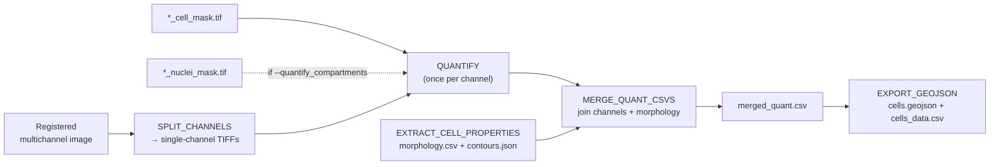

# Per-Cell Quantification

Once [segmentation](segmentation.md) has drawn the cells, quantification answers the question that actually matters for analysis: **how much of each marker is inside each cell?** MIRAGE measures every channel against the segmentation masks and assembles a single tidy table — one row per cell, one column per marker — plus morphology, ready for QuPath or any downstream tool.

The decision you face here is about **granularity**: a fast whole-cell mean (the default), per-**compartment** signal (nucleus / cytoplasm / cell), or per-compartment signal with **expanded statistics** (median and integrated density). This page covers all three, plus the morphology features and the path from CSV to GeoJSON.

## The quantification flow



1. **`SPLIT_CHANNELS`** splits the registered multichannel image into one single-channel TIFF per marker.
2. **`QUANTIFY`** runs **once per channel**, measuring per-cell intensity using the **cell mask** (and the nuclei mask too, when compartments are enabled).
3. **`EXTRACT_CELL_PROPERTIES`** computes morphology **once per patient** with `regionprops`, emitting `morphology.csv` and a simplified-polygon `contours.json`.
4. **`MERGE_QUANT_CSVS`** joins every per-channel CSV with the morphology table into one `merged_quant.csv`.
5. **`EXPORT_GEOJSON`** writes the QuPath-native `geojson/cells.geojson` plus `geojson/cells_data.csv`.

The merged table lands at:

```text
<outdir>/<patient>/quantification/merged_quant.csv
```

---

## Default whole-cell quantification

By default, each marker column holds the **mean intensity** of that channel within each cell (every pixel where `cell_mask == C`). This is the lightest, fastest mode and is what you get with no extra flags.

### Column schema

| Column | Meaning |
| --- | --- |
| `label` | Cell instance ID (matches the label in `cell_mask.tif`). |
| `<MARKER>` | Mean intensity of that marker within the cell — **one column per channel**. |
| `y`, `x` | Centroid coordinates. |
| `area` | Cell area (px). |
| `eccentricity` | Shape eccentricity (0 = circle). |
| `perimeter` | Cell perimeter. |
| `convex_area` | Area of the convex hull. |
| `axis_major_length` | Major axis of the fitted ellipse. |
| `axis_minor_length` | Minor axis of the fitted ellipse. |
| `solidity` | Area / convex_area (compactness). |
| `fov` | Patient ID (field of view). |
| `cell_size` | Cell size. |

!!! example "Example `merged_quant.csv` (whole-cell mode)"

    ```csv
    label,DAPI,CD3,CD8,y,x,area,eccentricity,perimeter,convex_area,axis_major_length,axis_minor_length,solidity,fov,cell_size
    1,1820.4,210.7,88.1,142.0,331.5,512,0.61,86.2,540,29.8,18.4,0.948,patientA,512
    2,1654.9,930.2,612.7,158.3,402.1,478,0.55,81.0,498,27.1,19.0,0.960,patientA,478
    3,1733.1,140.5,71.6,170.6,360.9,531,0.67,90.4,562,31.2,17.9,0.945,patientA,531
    ```

---

## Compartment quantification

`--quantify_compartments true` (default `false`)

Set this flag to break each marker's signal into **subcellular compartments**. MIRAGE routes the **nuclei mask** into `QUANTIFY` alongside the cell mask and emits three columns per marker:

| Column | Definition |
| --- | --- |
| `"<MARKER>: Nucleus: Mean"` | Pixels where `cell_mask == C` **AND** `nuclei_mask > 0`. |
| `"<MARKER>: Cytoplasm: Mean"` | Cell minus nucleus (`cell_mask == C` and `nuclei_mask == 0`). |
| `"<MARKER>: Cell: Mean"` | The whole cell (`cell_mask == C`). |

!!! info "No label pairing required"
    Compartments are computed by **pixel-wise intersection** of the two masks, not by matching a nucleus ID to a cell ID. That means the nuclei and cell masks can be **independent label fields** — and compartment quantification works with **any segmentation backend** (StarDist, InstanSeg, or CellSAM).

!!! example "Example columns (compartment mode)"

    ```csv
    label,"CD3: Nucleus: Mean","CD3: Cytoplasm: Mean","CD3: Cell: Mean",...
    1,95.2,260.8,210.7,...
    2,402.1,1180.5,930.2,...
    ```

---

## Expanded statistics

`--expanded_quantification true` (default `false`) — **requires** `--quantify_compartments true`

On top of the per-compartment means, this flag adds two more statistics **per compartment**: `Median` and `Sum` (integrated density).

| Statistic | Meaning | Example column |
| --- | --- | --- |
| `Mean` | Average intensity in the compartment | `"<MARKER>: Nucleus: Mean"` |
| `Median` | Median intensity (robust to outliers) | `"<MARKER>: Nucleus: Median"` |
| `Sum` | Integrated density (total signal) | `"<MARKER>: Cell: Sum"` |

This is heavier: computing a median requires gathering every pixel per cell, so expect longer runtimes and more memory than mean-only modes.

!!! warning "Validation rule"
    `--expanded_quantification true` **requires** `--quantify_compartments true`. Setting expanded statistics without compartments raises a validation error before the run starts — `Median` / `Sum` only make sense once the compartments they describe exist.

---

## One marker across all three modes

The same marker, `CD8`, illustrates how the columns grow as you increase granularity:

=== "Default (whole-cell)"

    ```csv
    label,CD8
    1,88.1
    ```

    A single mean per cell.

=== "Compartments"

    `--quantify_compartments true`

    ```csv
    label,"CD8: Nucleus: Mean","CD8: Cytoplasm: Mean","CD8: Cell: Mean"
    1,12.4,121.0,88.1
    ```

    Three means — signal split into nucleus, cytoplasm, and whole cell.

=== "Expanded"

    `--quantify_compartments true --expanded_quantification true`

    ```csv
    label,"CD8: Nucleus: Mean","CD8: Nucleus: Median","CD8: Nucleus: Sum","CD8: Cytoplasm: Mean","CD8: Cytoplasm: Median","CD8: Cytoplasm: Sum","CD8: Cell: Mean","CD8: Cell: Median","CD8: Cell: Sum"
    1,12.4,9.0,1488,121.0,110.0,42350,88.1,80.0,45088
    ```

    Mean, median, and integrated density for each of the three compartments.

!!! tip "Choosing a mode"
    - **Whole-cell mean** — phenotyping where compartmental localization doesn't matter; smallest CSV, fastest.
    - **Compartments** — when nuclear vs. cytoplasmic localization is biologically meaningful (e.g. transcription factors).
    - **Expanded** — when you need robust statistics (median) or total signal (integrated density) per compartment.

---

## Morphology features

Morphology is computed **once per patient** by `EXTRACT_CELL_PROPERTIES` (scikit-image `regionprops`), producing `morphology.csv` and a simplified-polygon `contours.json` (Douglas–Peucker simplification). `MERGE_QUANT_CSVS` joins these morphology columns onto every cell row.

| Feature | Description |
| --- | --- |
| `y`, `x` | Centroid coordinates. |
| `area` | Number of pixels in the cell. |
| `eccentricity` | Eccentricity of the fitted ellipse (0 = circular). |
| `perimeter` | Perimeter length. |
| `convex_area` | Area of the convex hull. |
| `axis_major_length` | Major axis length of the fitted ellipse. |
| `axis_minor_length` | Minor axis length of the fitted ellipse. |
| `solidity` | `area / convex_area` — how "filled in" the shape is. |

---

## From CSV to GeoJSON

`EXPORT_GEOJSON` consumes `merged_quant.csv` (and the simplified `contours.json`) to produce two artifacts under `<outdir>/<patient>/geojson/`:

| File | Purpose |
| --- | --- |
| `cells.geojson` | Per-cell polygons with **QuPath-native measurement names**, ready to drop into QuPath. |
| `cells_data.csv` | Flat per-cell table including **per-marker z-scores**. |

The GeoJSON measurement names follow QuPath conventions, for example:

- `"Centroid X µm"`, `"Centroid Y µm"`
- `"Area µm²"`
- `"Eccentricity"`
- one measurement per marker (plus its z-score in `cells_data.csv`)

See [export](export.md) for the full GeoJSON schema and [outputs](outputs.md) for where everything lands on disk.

---

## Parameters recap

| Parameter | Default | Effect |
| --- | --- | --- |
| `quantify_compartments` | `false` | Emit `Nucleus` / `Cytoplasm` / `Cell` mean columns per marker. |
| `expanded_quantification` | `false` | Also emit `Median` and `Sum` per compartment. **Requires** `quantify_compartments`. |

```bash
# Whole-cell mean (default)
nextflow run . -profile test,docker --outdir results

# Per-compartment signal
nextflow run . -profile test,docker \
    --quantify_compartments true --outdir results

# Per-compartment with median + integrated density
nextflow run . -profile test,docker \
    --quantify_compartments true \
    --expanded_quantification true \
    --outdir results
```

## Related pages

<div class="grid cards" markdown>

- :material-grid:{ .lg .middle } **[Segmentation](segmentation.md)** — the masks quantification measures against.
- :material-export:{ .lg .middle } **[Export](export.md)** — GeoJSON schema and QuPath integration.
- :material-file-tree:{ .lg .middle } **[Outputs](outputs.md)** — directory layout for CSVs and GeoJSON.
- :material-tune:{ .lg .middle } **[Parameters](parameters.md)** — full parameter reference.

</div>
