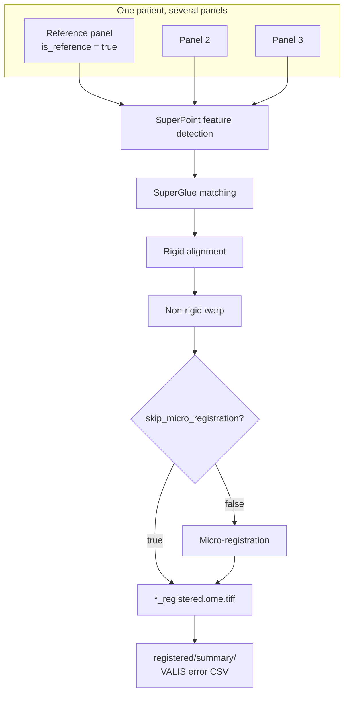

# Registration Methods

Registration is the second of MIRAGE's three stages (preprocessing → registration → postprocessing). It takes each patient's separately-acquired panels — which never land in perfectly the same place — and warps them all into **one shared coordinate space** so that a pixel at `(x, y)` means the same physical location in every channel.

Get this right and a cell's CD8 reading and its PANCK reading come from the same spot. Get it wrong and every downstream measurement is noise.

!!! info "Where this fits"
    Registration runs when the stage range includes it: `--start registration`, or the default end-to-end run. To run only this stage from preprocessed inputs:

    ```bash
    nextflow run . \
      --input csv/preprocessed.csv \
      --start registration --stop registration \
      --outdir results
    ```

    See [restartability_guide.md](restartability_guide.md) and [workflow.md](workflow.md).

## The only method: VALIS

MIRAGE registers with **VALIS** (Virtual Alignment of pathoLogy Image Series). It is the only supported method, and `valis` is the only valid value:

```bash
--registration_method valis
```

- **Container:** `cdgatenbee/valis-wsi:1.0.0`

VALIS aligns all of a patient's panels to the **reference panel's** coordinate space using deep-learning feature detection (**SuperPoint** keypoints matched with **SuperGlue**) to drive both a **rigid** alignment and a **non-rigid** warp, with optional **micro-registration** for a final fine refinement.



!!! quote "VALIS reference"
    VALIS is described in Gatenbee *et al.* 2023. See [citation.md](citation.md).

---

## Choosing the reference

Every patient needs exactly one **reference** image — the fixed coordinate space all other panels warp into.

- The reference is the samplesheet row with **`is_reference=true`**.
- If **no** row is flagged and **`--allow_auto_reference true`**, the **first image** for that patient is used.
- If no row is flagged and auto-reference is **off**, registration **errors** for that patient.

!!! warning "Pick your reference deliberately"
    Choose the panel with the cleanest, most feature-rich nuclear signal as the reference — usually your best DAPI panel. Auto-reference is a convenience fallback, not a substitute for a considered choice. See [input_spec.md](input_spec.md) for the `is_reference` column.

The channels VALIS leans on to *pick and align* the reference are controlled by **`reg_reference_markers`** (default `['DAPI','FITC']`).

---

## Memory mode

`--memory_mode` trades alignment fidelity for RAM. The default is `medium`.

=== "high"

    SuperPoint / SuperGlue feature detection at **larger maximum dimensions**. Best alignment quality, highest memory footprint.

    ```bash
    --memory_mode high
    ```

=== "medium (default)"

    Balanced dimensions and detector settings. The sensible starting point for most cohorts.

    ```bash
    --memory_mode medium
    ```

=== "low"

    Falls back to **BRISK** feature detection with **RANSAC** matching at **small dimensions**. Use this when RAM is the constraint and a high-memory run would OOM.

    ```bash
    --memory_mode low
    ```

| Mode | Detector / matcher | Max dims | When to use |
| --- | --- | --- | --- |
| `high` | SuperPoint / SuperGlue | larger | Best quality, plenty of RAM |
| `medium` | SuperPoint / SuperGlue | balanced | Default |
| `low` | BRISK / RANSAC | small | RAM-limited nodes |

!!! tip "OOM on registration?"
    Registration is the most memory-hungry stage. If a patient with many large panels keeps getting killed, drop to `--memory_mode low` before throwing more hardware at it. See [slurm.md](slurm.md) for cluster resource tuning.

---

## Parameters

### Reference & alignment

| Parameter | Default | What it does |
| --- | --- | --- |
| `reg_reference_markers` | `['DAPI','FITC']` | Channels used to pick and align the reference. |
| `reg_max_image_dim` | `4000` | Maximum image dimension (px) used during registration. |
| `reg_micro_reg_fraction` | `0.125` | Fraction of image size used for the micro-registration refinement. |
| `skip_micro_registration` | `true` | Skip the final fine micro-registration pass. |

### Performance & tiling

| Parameter | Default | What it does |
| --- | --- | --- |
| `reg_parallel_warping` | `false` | Warp channels in parallel (faster, more RAM). |
| `reg_n_workers` | `8` | Worker processes for registration. |
| `reg_use_tiled_registration` | `true` | Register in tiles to bound memory on large slides. |
| `reg_tile_size` | `2048` | Tile size (px) when tiled registration is on. |

### Padding

Panels of different sizes can be padded to a common canvas before alignment so the warp has room to work.

| Parameter | Default | What it does |
| --- | --- | --- |
| `padding` | `false` | Pad all panels to the patient's **max dimensions** before registration. |
| `pad_mode` | `constant` | Padding fill: `constant`, `edge`, `reflect`, or `symmetric`. |

=== "No padding (default)"

    ```bash
    --padding false
    ```

=== "Constant pad"

    Pad with a constant value (typically zero) to the max canvas:

    ```bash
    --padding true --pad_mode constant
    ```

=== "Reflect pad"

    Mirror border pixels instead of filling with zeros — sometimes gentler on edge features:

    ```bash
    --padding true --pad_mode reflect
    ```

- **Output:** `<outdir>/<patient_id>/registered/*_registered.ome.tiff`
- **Error summary:** `REGISTER` writes a per-patient VALIS error summary CSV to `<outdir>/<patient_id>/registered/summary/`.

---

## Quality control

`GENERATE_REGISTRATION_QC` builds RGB overlays so you can see, at a glance, whether channels actually line up — the reference in one color channel, an aligned panel in another, agreement where they overlap.

| File | Description |
| --- | --- |
| `*_QC_RGB.png` | Downscaled RGB overlay (quick visual check) |
| `*_QC_RGB.tif` | RGB overlay, TIFF |
| `*_QC_RGB_fullres.tif` | Full-resolution RGB overlay |

- **Output:** `<outdir>/<patient_id>/qc/registration/qc/`
- Skip with **`--skip_registration_qc true`**.

```bash
# Skip registration QC on a large cohort
nextflow run . \
  --input csv/preprocessed.csv \
  --start registration \
  --skip_registration_qc true \
  --outdir results
```

### Feature-based error estimation (optional)

For a **quantitative** measure of alignment quality — not just a visual overlay — enable feature-distance estimation. VALIS detects matched features between the reference and each aligned panel and measures the residual distance between them.

```bash
nextflow run . \
  --input csv/preprocessed.csv \
  --start registration \
  --enable_feature_error true \
  --feature_detector superpoint \
  --feature_max_dim 1024 \
  --feature_n_features 5000 \
  --outdir results
```

| Parameter | Default | What it does |
| --- | --- | --- |
| `enable_feature_error` | `false` | Turn on feature-distance error estimation. |
| `feature_detector` | `superpoint` | Detector: `superpoint`, `disk`, `dedode`, `brisk`, or `vgg`. |
| `feature_max_dim` | `1024` | Max image dimension (px) for feature detection. |
| `feature_n_features` | `5000` | Number of features to detect. |

- **Output:** `<outdir>/<patient_id>/feature_distances/`

!!! note "Two complementary error stories"
    - **[registration_errors.md](registration_errors.md)** — a deep dive into the D / rTRE metrics VALIS reports in the `registered/summary/` CSV.
    - **[estimate_feature_distances.md](estimate_feature_distances.md)** — how the optional feature-distance method works and how to read its output.

---

## Resources

`REGISTER` is provisioned for the heaviest stage in the pipeline:

| Resource | Value |
| --- | --- |
| CPUs | 8 |
| Memory | 300 GB × `task.attempt` |
| Time | 24 h |
| maxForks | 5 |
| Retries | on transient exit codes |

Memory scales with the attempt number, so a first-attempt OOM is retried with more RAM automatically. See [slurm.md](slurm.md) for adapting these to your scheduler.

---

## Outputs recap

| Path | Produced by | Contents |
| --- | --- | --- |
| `<outdir>/<patient_id>/registered/` | REGISTER | `*_registered.ome.tiff` |
| `<outdir>/<patient_id>/registered/summary/` | REGISTER | VALIS error summary CSV |
| `<outdir>/<patient_id>/qc/registration/qc/` | GENERATE_REGISTRATION_QC | RGB overlays |
| `<outdir>/<patient_id>/feature_distances/` | feature error (optional) | Feature-distance results |
| `csv/registered.csv` (launch dir) | stage checkpoint | One row per registered image, all patients |

Resume the next stage with:

```bash
nextflow run . \
  --input csv/registered.csv \
  --start postprocessing \
  --outdir results
```

---

## Next steps

<div class="grid cards" markdown>

-   :material-chart-scatter-plot: **Registration errors**

    ---

    Read and interpret the D / rTRE metrics.

    [→ registration_errors.md](registration_errors.md)

-   :material-vector-difference: **Feature distances**

    ---

    The optional quantitative error method.

    [→ estimate_feature_distances.md](estimate_feature_distances.md)

-   :material-arrow-right-circle: **On to segmentation**

    ---

    Postprocessing starts with cell segmentation.

    [→ segmentation.md](segmentation.md)

-   :material-tune: **All parameters**

    ---

    Every `reg_*`, padding, and feature flag.

    [→ parameters.md](parameters.md)

</div>
