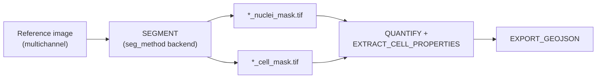
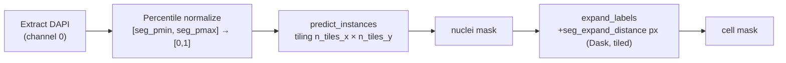

# Cell Segmentation

Segmentation is where MIRAGE turns a registered, multichannel image into **objects** — one integer label per cell. Everything downstream (per-cell [quantification](quantification.md), morphology, and the [GeoJSON export](export.md)) is built on top of the masks produced here, so this is one of the most consequential choices in the pipeline.

The decision you actually face is short: **which backend best matches your data and your hardware?** This page walks you through that choice and then documents each of the three backends in depth.

!!! info "Where this runs"
    `SEGMENT` runs during the **postprocessing** step, once per patient, on the **reference image** only (the fixed image chosen during [registration](registration_methods.md)). It does **not** segment every channel image — segmentation defines the cell boundaries that all channels are later measured against.

## What SEGMENT produces

Regardless of backend, `SEGMENT` emits exactly **two integer-label masks** (plus a `versions.yml` and a tracing size log), so the rest of the pipeline is contract-preserving:

| Output | Meaning | dtype |
| --- | --- | --- |
| `*_nuclei_mask.tif` | One integer label per **nucleus** instance | `uint32` |
| `*_cell_mask.tif` | One integer label per **whole-cell** instance | `uint32` |

In both masks, background is `0` and each object carries a unique positive integer ID. Label `C` in the cell mask is the cell whose nucleus may carry a different ID in the nuclei mask — the masks are **independent label fields**, not a paired nucleus→cell mapping. (This matters for [compartment quantification](quantification.md#compartment-quantification), which intersects the two masks pixel-wise rather than matching labels.)



## Which backend should I use?

The backend is selected with `--seg_method`, validated to one of `stardist` (default), `instantseg`, or `cellsam`. Each is a genuinely different model family with different input expectations.

<div class="grid cards" markdown>

-   :material-star-four-points:{ .lg .middle } **StarDist** &nbsp;`stardist`

    ---

    Star-convex **CNN nuclei detector**. Consumes the **DAPI channel only** (must be channel 0). Whole-cell mask is built by **expanding** nuclei outward.

    **Pick it when** DAPI is clean and your cells are roughly convex (the default, well-trodden path).

    **Key knobs:** `seg_pmin`/`seg_pmax`, `seg_n_tiles_x`/`seg_n_tiles_y`, `seg_expand_distance`.

-   :material-image-multiple:{ .lg .middle } **InstanSeg** &nbsp;`instantseg`

    ---

    **Channel-invariant CNN** that reads the **full multichannel image** directly and predicts nuclei **and** cells in one pass — no expansion, no DAPI-channel-0 requirement.

    **Pick it when** you want true membrane-aware cell boundaries, or DAPI isn't channel 0.

    **Key knobs:** `seg_instantseg_target`, `seg_instantseg_tile_size`, `seg_instantseg_batch_size`.

-   :material-robot-outline:{ .lg .middle } **CellSAM** &nbsp;`cellsam`

    ---

    **SAM foundation model**. Segments the **nuclear (DAPI) channel located by name**, then expands to whole-cell. Strong zero-shot generalization; native whole-slide tiling.

    **Pick it when** you want a foundation-model nuclei detector and can supply DEEPCELL credentials or pre-downloaded weights.

    **Key knobs:** `seg_cellsam_bbox_threshold`, `seg_cellsam_block_size`, `seg_cellsam_use_wsi`.

</div>

| | StarDist | InstanSeg | CellSAM |
| --- | --- | --- | --- |
| **Input channels** | DAPI only (channel 0, enforced) | Full multichannel | DAPI channel (found by name) |
| **Model type** | Star-convex CNN | Channel-invariant CNN | SAM foundation model |
| **Nuclei → cell** | Expand nuclei (`seg_expand_distance`) | Predicted directly (both masks) | Expand nuclei (`seg_expand_distance`) |
| **Container** | `…:segmentation_gpu` | `…:instant_seg` | `…:cellsam` |
| **Needs credentials?** | No | No | Yes, unless weights pre-downloaded |
| **When to pick it** | Default; clean DAPI, convex nuclei | Membrane-aware cells; DAPI not at ch.0 | Foundation-model robustness; WSI tiling |

!!! tip "The container is automatic"
    You do **not** select a container manually. `SEGMENT` picks the right image from `--seg_method`:

    - `stardist` → `bolt3x/attend_image_analysis:segmentation_gpu`
    - `instantseg` → `bolt3x/attend_image_analysis:instant_seg`
    - `cellsam` → `bolt3x/attend_image_analysis:cellsam`

## GPU vs CPU

All three backends are GPU-accelerated by default.

!!! note "`--seg_gpu` (default `true`)"
    With `--seg_gpu true`, MIRAGE requests `--gres=gpu:${gpu_type}` from the scheduler and passes Singularity's `--nv` flag to expose the GPU inside the container. Set `--seg_gpu false` to force CPU execution — it works for all three backends but is substantially **slower**, especially for CellSAM and InstanSeg.

The `SEGMENT` process uses the `process_high` resource label: **2 CPUs, 32–128 GB RAM scaling with input file size, 4 h** wall time. Memory scales with `task.attempt`, so transient OOM kills are retried at a higher tier.

---

## StarDist (default)

`--seg_method stardist`

StarDist is a CNN that detects **star-convex** nuclei — a good fit for the roughly round nuclei seen in DAPI. It is the default and the most battle-tested backend in MIRAGE.

!!! warning "DAPI must be channel 0"
    StarDist consumes the **DAPI channel only**, and that channel **must be index 0**. This is enforced at runtime: the process aborts with a clear error if channel 0 isn't named `DAPI`. In normal runs you don't have to do anything — `CONVERT_IMAGE` upstream guarantees DAPI is moved to channel 0. See [preprocessing](preprocessing.md).

### How it works



1. **Extract DAPI** from channel 0.
2. **Percentile-normalize** intensities to `[0, 1]` using `seg_pmin` / `seg_pmax` — robust to outliers and saturated pixels.
3. **Detect nuclei** with StarDist's `predict_instances`, tiled `seg_n_tiles_x` × `seg_n_tiles_y` to bound memory on large images.
4. **Expand** each nucleus label outward by `seg_expand_distance` pixels with a tiled, Dask-backed `skimage.segmentation.expand_labels` to synthesize the whole-cell mask. Expansion stops where labels meet, so neighbours don't bleed into each other.

### Parameters

| Parameter | Default | Guidance |
| --- | --- | --- |
| `seg_pmin` | `1.0` | Lower percentile for normalization. Raise to suppress dim background. |
| `seg_pmax` | `99.8` | Upper percentile. Lower it if bright debris saturates the dynamic range. |
| `seg_n_tiles_x` | `16` | Horizontal tiles for prediction. More tiles = lower peak memory, slightly slower. |
| `seg_n_tiles_y` | `16` | Vertical tiles. Increase together with `seg_n_tiles_x` on very large images / small GPUs. |
| `seg_expand_distance` | `10` | Pixels to grow nuclei into the whole-cell mask. Match to your cell radius. |
| `segmentation_model` | `stardist_full_e200_lr00001_aug1_seed10_es50p0.001_rlr0.5p50` | Pretrained model name (bundled). |
| `segmentation_model_dir` | `null` | Custom model directory. When `null`, the bundled model is used. |

### Run it

```bash
nextflow run . -profile test,docker \
    --seg_method stardist \
    --seg_expand_distance 10 \
    --outdir results
```

---

## InstanSeg

`--seg_method instantseg`

InstanSeg is a **channel-invariant** CNN: it ingests the **full multichannel image** as-is and predicts nuclei **and** whole-cell instances in a single forward pass. There is no nuclei-expansion step and **no DAPI-channel-0 requirement** — a good escape hatch when your channel ordering doesn't match StarDist's expectation, or when you want genuinely membrane-aware cell boundaries.

!!! note "Single-target replication"
    `seg_instantseg_target` chooses what to predict: `all_outputs` (default) yields distinct nuclei and cell masks. If you request a single target (`cells` or `nuclei`), that one mask is **replicated to both** `_nuclei_mask.tif` and `_cell_mask.tif` so the downstream contract still holds.

### Parameters

| Parameter | Default | Guidance |
| --- | --- | --- |
| `seg_instantseg_model` | `fluorescence_nuclei_and_cells` | BioImage.IO model name. |
| `seg_instantseg_target` | `all_outputs` | `all_outputs` \| `cells` \| `nuclei`. Single targets are replicated to both masks. |
| `seg_instantseg_tile_size` | `512` | Tile side in px at the model's working pixel size. |
| `seg_instantseg_batch_size` | `16` | Tiles per forward pass. **Raise** on big GPUs (H200/H100); **lower** to avoid OOM on small GPUs. |
| `pixel_size` | auto | Passed through; auto-detected from OME metadata if omitted. |
| `instanseg_model_dir` | `null` | Writable host path for the BioImage.IO model cache (see tip). |

InstanSeg processes the image with a tiled `eval_medium_image`, so **peak memory is bounded by `tile_size × batch_size`** — those two knobs are your primary OOM controls.

!!! tip "Set a persistent model cache with `instanseg_model_dir`"
    InstanSeg downloads its model from BioImage.IO on first use and writes it to the path given by the `INSTANSEG_BIOIMAGEIO_PATH` environment variable, which MIRAGE sets from `instanseg_model_dir`. The default cache lives inside the container's `site-packages`, which is **read-only under Singularity**. When `instanseg_model_dir` is `null`, MIRAGE falls back to a **per-task work-dir cache that re-downloads the model on every task**. Point `instanseg_model_dir` at a writable, shared host path to download the model once and reuse it across tasks.

### Run it

```bash
# Dedicated convenience profile (mirrors `test`, then sets seg_method=instantseg)
nextflow run . -profile instantseg_test,docker --outdir results

# Or explicitly, tuned for a small GPU
nextflow run . -profile test,docker \
    --seg_method instantseg \
    --seg_instantseg_target all_outputs \
    --seg_instantseg_tile_size 512 \
    --seg_instantseg_batch_size 4 \
    --instanseg_model_dir /shared/models/instanseg \
    --outdir results
```

---

## CellSAM

`--seg_method cellsam`

CellSAM wraps the **SAM (Segment Anything) foundation model** for cell segmentation. It segments the **nuclear (DAPI) channel**, then — like StarDist — derives the whole-cell mask by expanding nuclei via `seg_expand_distance`.

!!! info "DAPI is found by name, not by position"
    Unlike StarDist, CellSAM does **not** assume DAPI is channel 0. It locates the DAPI channel **by name** from the `channels` column of your sample sheet (see [input spec](input_spec.md)) and passes that explicit index to the model. If no `DAPI` channel exists, the process **fails loudly** rather than silently segmenting the wrong channel.

### Parameters

| Parameter | Default | Guidance |
| --- | --- | --- |
| `seg_cellsam_bbox_threshold` | `0.4` | The main precision/recall knob. **Lower** detects more (often smaller/dimmer) cells; **raise** for fewer, higher-confidence detections. |
| `seg_cellsam_use_wsi` | `true` | Native whole-slide tiling for large images. Keep on for WSI-scale inputs. |
| `seg_cellsam_block_size` | `400` | Tile side in px. Recommended range **256–2048**. |
| `seg_cellsam_overlap` | `56` | Tile overlap in px — guards against cells cut at tile seams. |
| `seg_expand_distance` | `10` | Pixels to expand nuclei into the whole-cell mask (shared with StarDist). |
| `cellsam_model_path` | `null` | Path to pre-downloaded weights for offline / container use (see warning). |

!!! warning "CellSAM weights need credentials or a pre-downloaded path"
    When `cellsam_model_path` is `null`, CellSAM **auto-downloads** its weights at runtime, which requires a DeepCell access token:

    ```bash
    export DEEPCELL_ACCESS_TOKEN=...   # before launching the pipeline
    ```

    MIRAGE forwards this token into the container automatically. The process warns early if both `cellsam_model_path` and `DEEPCELL_ACCESS_TOKEN` are unset, since the download will almost certainly fail.

!!! danger "Clusters without compute-node internet"
    On HPC where compute nodes have no outbound network, runtime auto-download cannot work. **Pre-download the weights** on a login node and set `--cellsam_model_path /path/to/weights` so segmentation runs fully offline. See [SLURM notes](slurm.md).

### Run it

```bash
# Dedicated convenience profile (mirrors `test`, then sets seg_method=cellsam)
export DEEPCELL_ACCESS_TOKEN=...
nextflow run . -profile cellsam_test,docker --outdir results

# Offline, with pre-downloaded weights and tuned thresholds
nextflow run . -profile test,docker \
    --seg_method cellsam \
    --cellsam_model_path /shared/models/cellsam.pt \
    --seg_cellsam_bbox_threshold 0.4 \
    --seg_cellsam_block_size 512 \
    --seg_cellsam_overlap 56 \
    --outdir results
```

---

## Tuning tips

!!! example "Dialing in segmentation quality"

    === "Expansion distance"

        `seg_expand_distance` (StarDist & CellSAM) controls how far nuclei grow into the whole-cell mask. Too small and you'll under-count cytoplasmic signal; too large and neighbouring cells over-merge. Match it to your typical cell radius in pixels. Expansion respects label boundaries, so adjacent cells won't overwrite each other.

    === "Percentile normalization"

        `seg_pmin` / `seg_pmax` (StarDist) clip the DAPI dynamic range before detection. Bright debris or saturated pixels? Lower `seg_pmax` (e.g. `99.5`). Faint nuclei lost in background? Raise `seg_pmin` slightly. The defaults (`1.0` / `99.8`) are robust for most fluorescence DAPI.

    === "Tile sizes & memory"

        - **StarDist:** more `seg_n_tiles_x` / `seg_n_tiles_y` → lower peak memory, slightly slower.
        - **InstanSeg:** peak memory ≈ `tile_size × batch_size`. Lower `seg_instantseg_batch_size` first to clear OOM; lower `seg_instantseg_tile_size` if that's not enough.
        - **CellSAM:** keep `seg_cellsam_use_wsi true` for WSI inputs; tune `seg_cellsam_block_size` within 256–2048.

    === "CellSAM bbox threshold"

        `seg_cellsam_bbox_threshold` is the dominant precision/recall control. Missing real cells? **Lower** it. Spurious detections / merged blobs? **Raise** it. Adjust in small steps (±0.05) and inspect the mask.

## Troubleshooting segmentation

| Symptom | Likely cause | Fix |
| --- | --- | --- |
| `ERROR: DAPI must be in channel 0` | StarDist run where channel 0 isn't DAPI | Let `CONVERT_IMAGE` reorder channels, or switch to `instantseg`. |
| `no 'DAPI' channel found …` (CellSAM) | No channel named `DAPI` in the sample sheet | Fix the `channels` column ([input spec](input_spec.md)) or change backend. |
| CellSAM weight download fails | Missing `DEEPCELL_ACCESS_TOKEN` / offline node | Export the token, or pre-download and set `cellsam_model_path`. |
| OOM kill in `SEGMENT` | Tiles too large for the GPU | InstanSeg: lower `batch_size`/`tile_size`. StarDist: raise `n_tiles`. Retries already escalate RAM. |
| InstanSeg re-downloads model every task | `instanseg_model_dir` unset | Point it at a writable shared path. |

For broader help, see [troubleshooting](troubleshooting.md) and the [FAQ](faq.md).

## Related pages

<div class="grid cards" markdown>

- :material-chart-bar:{ .lg .middle } **[Quantification](quantification.md)** — how masks become per-cell marker measurements.
- :material-tune:{ .lg .middle } **[Parameters](parameters.md)** — the full parameter reference.
- :material-file-tree:{ .lg .middle } **[Outputs](outputs.md)** — where masks and CSVs land on disk.
- :material-sitemap:{ .lg .middle } **[Workflow](workflow.md)** — how `SEGMENT` fits the postprocessing step.

</div>
