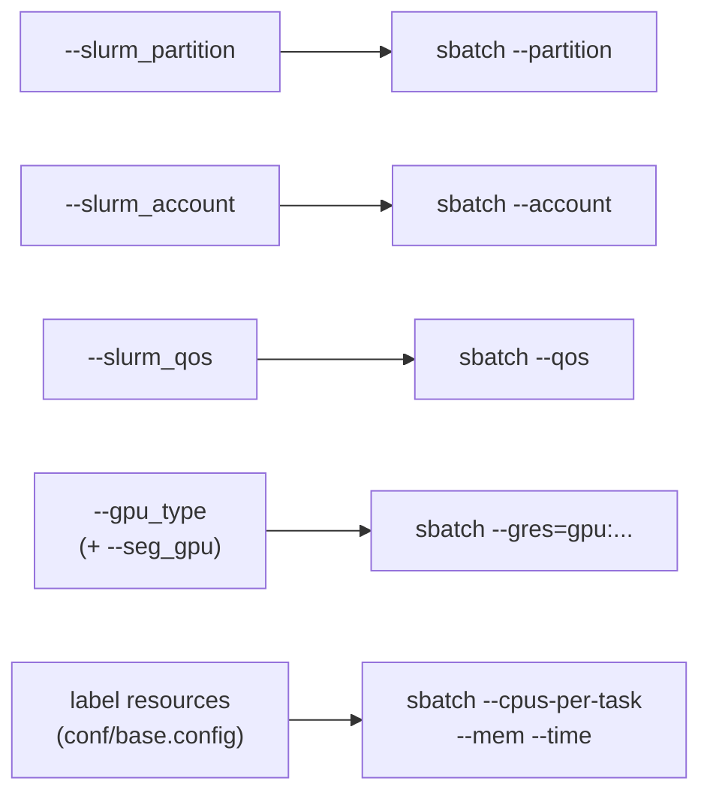
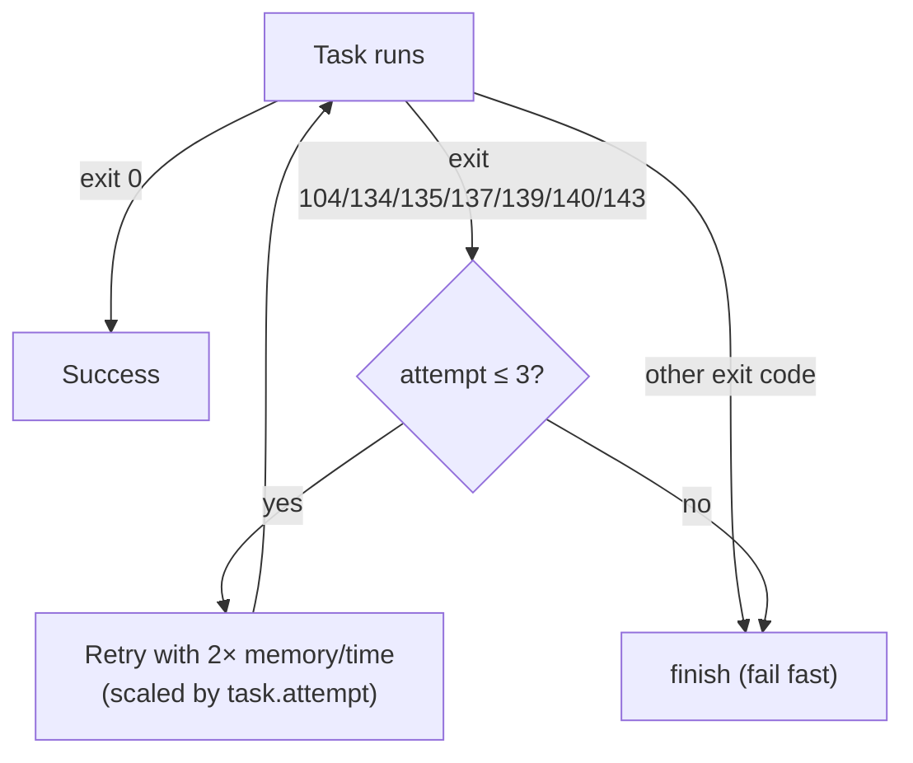
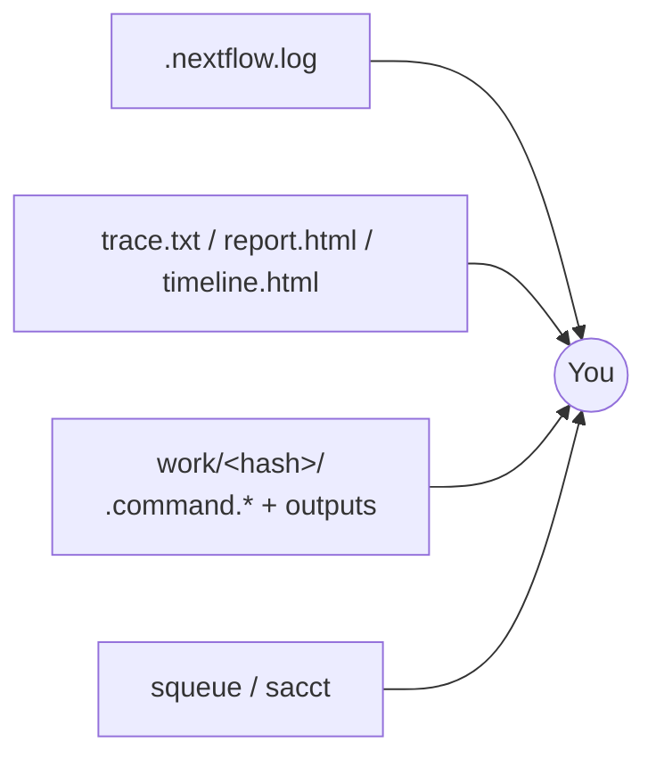

# Running on HPC / SLURM

MIRAGE is designed to run comfortably on a single workstation **and** to scale out across an HPC cluster. On shared systems the recommended setup is the SLURM executor with Singularity containers — Nextflow submits each process as its own `sbatch` job, and the pipeline handles retries, resource scaling, and GPU placement for you.

This guide covers the standard invocation, how parameters map onto `sbatch`, GPU jobs, resource labels and retries, the Singularity cache, site configuration, and how to monitor a running pipeline.

!!! tip "In a hurry?"
    Jump to the [Recommended starting point for real data](#recommended-starting-point-for-real-data) admonition near the end — it bundles the flags most people actually need.

---

## The standard invocation

Combine the `slurm` and `singularity` profiles with a comma, then supply your partition, account, and QOS:

```bash
nextflow run . \
    -profile slurm,singularity \
    --input samplesheet.csv \
    --outdir /scratch/$USER/mirage_results \
    --slurm_partition gpu \
    --slurm_account my_lab \
    --slurm_qos normal
```

- **`slurm`** sets `executor = slurm`, wires the queue and `clusterOptions` from the SLURM params, and enables GPU `--gres` requests where needed.
- **`singularity`** enables Singularity with `autoMounts` so your input/output paths are bound into the container automatically.

!!! info "Profiles are composable"
    Profiles are merged left-to-right. `slurm,singularity` is the workhorse combination, but you can layer a site profile on top (e.g. `slurm,singularity,ieo`) or swap the container engine (`slurm,conda`). See [usage.md](usage.md) for the full profile list.

The available execution profiles are:

| Profile | What it does |
|---|---|
| `slurm` | `executor = slurm`; builds `--account`/`--qos`/`--gres` via `clusterOptions`, queue from `slurm_partition` |
| `local` | `executor = local`; caps the machine to 4 CPU / 16 GB for laptops and login nodes |
| `singularity` | Enables Singularity with `autoMounts` |
| `docker` | Enables Docker |
| `conda` | Resolves dependencies via Conda |
| `test`, `test_full` | Minimal / full bundled test datasets |
| `instantseg_test`, `cellsam_test` | Segmentation-backend smoke datasets |
| `ieo` | Site-specific (gitignored); copy `conf/site.config.template` → `conf/ieo.config` |

---

## How the `slurm` profile maps params → `sbatch`

When you set the SLURM params, the `slurm` profile translates them into the flags Nextflow passes to `sbatch` for **every** task:

```groovy
// nextflow.config (slurm profile, conceptually)
process {
    executor = 'slurm'
    queue    = params.slurm_partition          // → sbatch --partition
    clusterOptions = {
        [
            params.slurm_account ? "--account=${params.slurm_account}" : null,
            params.slurm_qos     ? "--qos=${params.slurm_qos}"         : null
        ].findAll().join(' ')
    }
}
```



| Parameter | Default | Maps to |
|---|---|---|
| `--slurm_partition` | (none) | `sbatch --partition` (the Nextflow `queue`) |
| `--slurm_account` | (none) | `--account=` in `clusterOptions` |
| `--slurm_qos` | (none) | `--qos=` in `clusterOptions` |
| `--gpu_type` | `nvidia_h200:1` | `--gres=gpu:<gpu_type>` for GPU processes |

!!! note "Leave a param unset to omit it"
    If your cluster does not use accounts or QOS, simply omit `--slurm_account` / `--slurm_qos`. The profile only adds a flag when the corresponding param is non-null.

The CPU, memory, and wall-time for each job come from the process **resource label** (see below), not from a global setting — so a lightweight conversion job and a heavyweight registration job request very different allocations from the same submission.

---

## GPU jobs

Only one process can use a GPU: **`SEGMENT`**. It is controlled by `--seg_gpu` (default `true`).

=== "GPU (default)"

    With `--seg_gpu true`, the segmentation job:

    - requests `sbatch --gres=gpu:${gpu_type}` (default `nvidia_h200:1`), and
    - runs Singularity with `--nv` so the container sees the device.

    ```bash
    nextflow run . -profile slurm,singularity \
        --input samplesheet.csv --outdir results \
        --slurm_partition gpu --slurm_account my_lab \
        --gpu_type nvidia_a100:1
    ```

=== "CPU only"

    Force CPU segmentation (useful when no GPU partition is available):

    ```bash
    nextflow run . -profile slurm,singularity \
        --input samplesheet.csv --outdir results \
        --seg_gpu false
    ```

!!! warning "Match `gpu_type` to your cluster's GRES names"
    The string after `gpu:` must be a GRES type your scheduler actually advertises. List what is available with:

    ```bash
    sinfo -o "%P %G"
    ```

    Pick a value matching the `gpu:<type>:<count>` syntax — for example `nvidia_a100:1`, `nvidia_h200:1`, or a plain `gpu:1` if your site does not type its GPUs.

!!! info "CellSAM backend needs a token"
    When segmenting with the CellSAM backend, MIRAGE forwards the `DEEPCELL_ACCESS_TOKEN` environment variable into the job. Export it in your submission environment before launching. See [segmentation.md](segmentation.md).

---

## Resource labels, caps, and retries

Every process is tagged with a **resource label** defined in `conf/base.config`. The label sets the base CPU / memory / time; memory and time scale with `task.attempt`, so a retried job automatically asks for more.

| Label | CPUs | Memory | Time | Typical use |
|---|---|---|---|---|
| `process_single` | 1 | 12 GB × attempt | 8 h | trivial / metadata steps |
| `process_low` | 2 | 32 GB × attempt | 2 h | light I/O |
| `process_medium` | 4 | 100 GB + 100 GB × attempt | 4 h | preprocessing |
| `process_high` | 8 | 200 GB + 100 GB × attempt | 12 h | heavy compute |
| `process_long` | — | — | 48 h × attempt | long-running steps |
| `process_high_memory` | — | 400 GB × attempt | — | memory-bound steps |

!!! danger "REGISTER is the heavyweight"
    `REGISTER` (VALIS) is the most demanding process: **8 CPU, 300 GB RAM, 24 h**, with `maxForks 5` to avoid swamping the cluster with concurrent registrations. Plan partition limits accordingly. See [registration_methods.md](registration_methods.md).

### Global caps (`--max_*`)

Per-process requests are clamped to global ceilings so a retry can never request more than your cluster can grant:

| Cap | Default |
|---|---|
| `--max_memory` | `700.GB` |
| `--max_cpus` | `128` |
| `--max_time` | `240.h` |

Lower these to fit a smaller partition, e.g. `--max_memory 256.GB --max_cpus 32`.

### Retry behaviour



The base `errorStrategy` retries only on resource-exhaustion / signal exit codes — `104, 134, 135, 137, 139, 140, 143` (connection reset, SIGABRT, SIGBUS, SIGKILL/OOM, SIGSEGV, SIGTERM) — up to **3 retries**. Any other exit code is treated as a genuine error and the run finishes. This means an OOM kill is recovered automatically by re-requesting more memory, while a code bug fails fast instead of burning your allocation. See [troubleshooting.md](troubleshooting.md) for reading exit codes.

---

## Singularity cache

On shared filesystems, point both cache variables at a **writable, shared** location so images are pulled once and reused by every node:

!!! warning "Set the cache before your first run"
    ```bash
    export NXF_SINGULARITY_CACHEDIR=/scratch/$USER/singularity_cache
    export SINGULARITY_CACHEDIR=/scratch/$USER/singularity_cache
    ```

    Without this, Singularity may try to write into `$HOME` (often quota-limited) or re-pull images on every node, wasting time and disk. The `ieo` profile sets these for you.

---

## Site configuration

Rather than typing the same flags every time, capture site defaults in a config file. Start from the template:

```bash
cp conf/site.config.template conf/my_site.config
```

```groovy title="conf/my_site.config"
params {
    outdir                 = '/scratch/results'
    segmentation_model_dir = '/shared/models/'
    slurm_partition        = 'gpu'
    slurm_account          = 'my_lab'
    slurm_qos              = 'normal'
    gpu_type               = 'nvidia_a100:1'
}

singularity {
    runOptions = '--writable-tmpfs --bind /shared/models'
}
```

Use it with `-c`:

```bash
nextflow run . -profile slurm,singularity -c conf/my_site.config \
    --input samplesheet.csv --outdir results
```

=== "Ad-hoc with `-c`"

    Quick, per-user, not checked in:

    ```bash
    nextflow run . -profile slurm,singularity -c conf/my_site.config ...
    ```

=== "Named profile (`ieo`)"

    The `ieo` profile is the IEO cluster's baked-in version of this pattern. It is **gitignored** — copy the template into place first:

    ```bash
    cp conf/site.config.template conf/ieo.config
    # edit conf/ieo.config for your account/partition
    nextflow run . -profile singularity,ieo \
        --input samplesheet.csv --outdir results
    ```

    The `ieo` profile also exports the Singularity cache variables and binds the shared model directory.

---

## Pre-pulling images

To avoid every job pulling its container on first use (which can collide under high concurrency), warm the cache up front. Pull the known images directly:

```bash
export NXF_SINGULARITY_CACHEDIR=/scratch/$USER/singularity_cache
singularity pull docker://bolt3x/attend_image_analysis:preprocess
singularity pull docker://bolt3x/attend_image_analysis:segmentation_gpu
singularity pull docker://cdgatenbee/valis-wsi:1.0.0
```

MIRAGE pins immutable image tags (never `:latest`); the containers used include `bolt3x/attend_image_analysis:*` (convert_bioformats_2, preprocess, segmentation_gpu, instant_seg, cellsam, quantification_gpu, merge, debug_diffeo) and `cdgatenbee/valis-wsi:1.0.0`. They are declared per process in `modules/local/*.nf`, with resources in `conf/modules.config`.

---

## Recommended starting point for real data

!!! success "A solid default for a real cohort on SLURM"
    ```bash
    export NXF_SINGULARITY_CACHEDIR=/scratch/$USER/singularity_cache
    export SINGULARITY_CACHEDIR=/scratch/$USER/singularity_cache

    nextflow run . \
        -profile slurm,singularity \
        --input samplesheet.csv \
        --outdir /scratch/$USER/mirage_results \
        --slurm_partition gpu \
        --slurm_account my_lab \
        --slurm_qos normal \
        --gpu_type nvidia_a100:1 \
        --max_memory 512.GB \
        --max_cpus 64 \
        --enable_trace \
        -resume
    ```

    - `-resume` reuses cached results so you can iterate without recomputing.
    - `--enable_trace` turns on trace/report/timeline for monitoring.
    - Tune `--max_memory` / `--max_cpus` to your partition's limits.
    - Run from a `screen`/`tmux` session or submit the `nextflow run` itself as a small driver job so it survives logout.

---

## Monitoring runs



- **`.nextflow.log`** — the canonical log in your launch directory. Tail it live:

  ```bash
  tail -f .nextflow.log
  ```

- **Trace / report / timeline** — enable with `--enable_trace` to collect a `trace.txt`, an HTML execution `report.html`, and a `timeline.html` under your output directory. These show per-task CPU, peak memory, wall-time, and exit status — invaluable for tuning resource labels and caps.

- **Work directories** — each task runs in `work/<2-char>/<hash>/`. Inside you'll find `.command.sh` (the exact script), `.command.log` / `.command.out` / `.command.err` (output), and the staged inputs/outputs. To find a failed task's directory, Nextflow prints the path in the error summary.

- **SLURM tools** — `squeue -u $USER` for queued/running jobs, `sacct -j <jobid>` for completed-job accounting (memory, exit code, elapsed). Nextflow's job names embed the process name so you can correlate.

!!! tip "Cleaning up"
    After a successful run, reclaim scratch with `nextflow clean -f` (removes work dirs for the latest run) or `nextflow clean -before <run_name> -f`. Keep the work directory while you still need `-resume`.

---

## See also

<div class="grid cards" markdown>

-   :material-tune: **Parameters**

    ---

    Every flag in one place, including all `--slurm_*` and `--max_*` options.

    [:octicons-arrow-right-24: parameters.md](parameters.md)

-   :material-book-open-variant: **Usage**

    ---

    Samplesheet format, step routing, and the full profile list.

    [:octicons-arrow-right-24: usage.md](usage.md)

-   :material-lifebuoy: **Troubleshooting**

    ---

    Decoding exit codes, OOM kills, registration failures, and stuck jobs.

    [:octicons-arrow-right-24: troubleshooting.md](troubleshooting.md)

</div>
