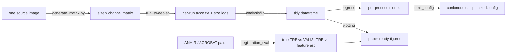

> **SUPERSEDED — historical record, 2026-09-02 (MIRAGE v1.0.0, release plan 13).**
> This document plans surfacing the ANHIR/ACROBAT landmark harness (`benchmarks/registration_eval/`)
> and the synthetic ground-truth rung that replaced it (`benchmarks/stare_bench/`) in the docs site;
> both were deleted and exist on no branch. `benchmarks/README.md` section B is the removal
> record. Nothing below is runnable; it is kept because it is the dated record of a
> decision that was actually taken. Do not edit the body — a June plan rewritten to
> describe a September tree is a lie about its own date.

# Benchmark Docs Implementation Plan

> **For agentic workers:** REQUIRED SUB-SKILL: Use superpowers:subagent-driven-development (recommended) or superpowers:executing-plans to implement this plan task-by-task. Steps use checkbox (`- [ ]`) syntax for tracking.

**Goal:** Surface the benchmarking framework in the Read the Docs site — a `docs/benchmarks.md` page (narrative + mermaid flow + figure slots + how the optimal `modules.config` is derived), a nav entry, and a one-command way to populate the page's figures from real benchmark runs.

**Architecture:** Extend `plotting.save_fig` with an opt-in `formats` arg (adds PNG for web) and thread it through `make_figures.run`; add `export_docs_figures.py` to render web PNGs straight into `docs/assets/images/benchmarks/`. The docs page follows the repo's existing convention: prose + mermaid + **commented-out image slots** awaiting the user's real figures (matching `docs/assets/images/README.md`).

**Tech Stack:** MkDocs Material (+ glightbox, mermaid — installed), Python (matplotlib), pytest.

This is **Plan 4 of 4** — the final plan. It consumes Plan 3's `make_figures`/`plotting` and the `conf/modules.optimized.config` they emit.

**Spec:** `docs/superpowers/specs/2026-06-16-benchmarking-framework-design.md` §9.

## File Structure

- Modify: `benchmarks/analysis/lib/plotting.py` (`save_fig` gains `formats`), `benchmarks/tests/test_plotting.py`.
- Modify: `benchmarks/analysis/make_figures.py` (`run` gains `formats`), `benchmarks/tests/test_make_figures.py`.
- Create: `benchmarks/analysis/export_docs_figures.py`, test in `benchmarks/tests/test_make_figures.py`.
- Create: `docs/benchmarks.md`, `docs/assets/images/benchmarks/.gitignore`.
- Modify: `mkdocs.yml` (nav entry), `docs/assets/images/README.md` (slot registry).

---

## Task 1: PNG-capable save_fig (TDD, backward-compatible)

**Files:** Modify `benchmarks/analysis/lib/plotting.py`; `benchmarks/tests/test_plotting.py`.

- [ ] **Step 1: Write the failing test (append to `benchmarks/tests/test_plotting.py`)**

```python
def test_save_fig_formats_arg_writes_only_requested(tmp_path):
    import matplotlib.pyplot as plt
    plotting.set_paper_theme()
    fig, ax = plt.subplots()
    ax.plot([0, 1], [1, 0])
    paths = plotting.save_fig(fig, tmp_path / "png_only", formats=("png",))
    assert (tmp_path / "png_only.png").exists()
    assert not (tmp_path / "png_only.pdf").exists()
    assert paths == [tmp_path / "png_only.png"]


def test_save_fig_default_still_pdf_svg(tmp_path):
    import matplotlib.pyplot as plt
    fig, ax = plt.subplots()
    ax.plot([0, 1], [0, 1])
    plotting.save_fig(fig, tmp_path / "d")
    assert (tmp_path / "d.pdf").exists() and (tmp_path / "d.svg").exists()
```

- [ ] **Step 2: Run, verify FAIL**

Run: `python -m pytest benchmarks/tests/test_plotting.py::test_save_fig_formats_arg_writes_only_requested -v`
Expected: FAIL — `save_fig() got an unexpected keyword argument 'formats'`.

- [ ] **Step 3: Implement — replace `save_fig` in `benchmarks/analysis/lib/plotting.py`**

```python
def save_fig(fig, path_stem, formats=("pdf", "svg")) -> list[Path]:
    """Save `fig` in each requested vector/raster format. Returns the paths.

    Default is paper-ready vectors (pdf+svg); pass formats=("png",) for web docs.
    """
    stem = Path(path_stem)
    stem.parent.mkdir(parents=True, exist_ok=True)
    out = []
    for ext in formats:
        p = stem.with_suffix(f".{ext}")
        fig.savefig(p)
        out.append(p)
    plt.close(fig)
    return out
```

- [ ] **Step 4: Run, verify PASS**

Run: `python -m pytest benchmarks/tests/test_plotting.py -v`
Expected: all pass (prior 3 + 2 new = 5).

- [ ] **Step 5: Commit**

```bash
git add benchmarks/analysis/lib/plotting.py benchmarks/tests/test_plotting.py
git commit -m ":sparkles: save_fig formats arg (PNG for web docs)" -m "Co-Authored-By: Claude Opus 4.8 (1M context) <noreply@anthropic.com>"
```

---

## Task 2: Thread formats through make_figures + export_docs_figures (TDD)

**Files:** Modify `benchmarks/analysis/make_figures.py`; Create `benchmarks/analysis/export_docs_figures.py`; `benchmarks/tests/test_make_figures.py`.

- [ ] **Step 1: Write failing tests (append to `benchmarks/tests/test_make_figures.py`)**

```python
def test_run_accepts_formats_and_writes_png(tmp_path):
    res = make_figures.run(
        results_root=FIX / "runs", run_plan_csv=FIX / "runs_run_plan.csv",
        manifest_csv=FIX / "runs_matrix_manifest.csv", reg_eval_csv=None,
        outdir=tmp_path, formats=("png",),
    )
    pngs = list((tmp_path / "figures").glob("scaling_*.png"))
    assert len(pngs) >= 1
    assert not list((tmp_path / "figures").glob("scaling_*.pdf"))


def test_export_docs_figures_writes_into_docs_dir(tmp_path):
    from benchmarks.analysis import export_docs_figures
    docs_img = tmp_path / "docs_imgs"
    out = export_docs_figures.export(
        results_root=FIX / "runs", run_plan_csv=FIX / "runs_run_plan.csv",
        manifest_csv=FIX / "runs_matrix_manifest.csv", docs_image_dir=docs_img,
    )
    assert docs_img.exists()
    assert list(docs_img.glob("scaling_*.png"))
    assert out == docs_img
```

- [ ] **Step 2: Run, verify FAIL**

Run: `python -m pytest benchmarks/tests/test_make_figures.py::test_run_accepts_formats_and_writes_png benchmarks/tests/test_make_figures.py::test_export_docs_figures_writes_into_docs_dir -v`
Expected: FAIL — `run() got an unexpected keyword argument 'formats'` / no module `export_docs_figures`.

- [ ] **Step 3: Implement — add `formats` to `make_figures.run`**

In `benchmarks/analysis/make_figures.py`, change the `run` signature and the `save_fig` call:

```python
def run(results_root, run_plan_csv, manifest_csv, reg_eval_csv, outdir, formats=("pdf", "svg")) -> dict:
```

and inside the per-process loop change:

```python
        plotting.save_fig(fig, figdir / f"scaling_{proc}")
```

to:

```python
        plotting.save_fig(fig, figdir / f"scaling_{proc}", formats=formats)
```

(Leave `main()` and the rest unchanged — default `formats` keeps existing behavior.)

- [ ] **Step 4: Implement `benchmarks/analysis/export_docs_figures.py`**

```python
"""Render benchmark figures as web PNGs into the docs image dir.

Run after a real sweep to populate docs/assets/images/benchmarks/, then
uncomment the matching image slots in docs/benchmarks.md.

  python -m benchmarks.analysis.export_docs_figures \
    --results-root bench_results --run-plan bench_run_plan.csv \
    --manifest bench_matrix/matrix_manifest.csv
"""
from __future__ import annotations

import argparse
from pathlib import Path

from . import make_figures

DEFAULT_DOCS_IMG = Path("docs/assets/images/benchmarks")


def export(results_root, run_plan_csv, manifest_csv, docs_image_dir=DEFAULT_DOCS_IMG,
           reg_eval_csv=None) -> Path:
    docs_image_dir = Path(docs_image_dir)
    # make_figures writes figures under <outdir>/figures; point that at the docs dir's parent
    res = make_figures.run(results_root, run_plan_csv, manifest_csv, reg_eval_csv,
                           outdir=docs_image_dir.parent, formats=("png",))
    figdir = Path(res["outdir"]) / "figures"
    docs_image_dir.mkdir(parents=True, exist_ok=True)
    for png in figdir.glob("scaling_*.png"):
        (docs_image_dir / png.name).write_bytes(png.read_bytes())
    return docs_image_dir


def main():
    ap = argparse.ArgumentParser(description="Export benchmark figures as docs PNGs.")
    ap.add_argument("--results-root", required=True)
    ap.add_argument("--run-plan", required=True)
    ap.add_argument("--manifest", required=True)
    ap.add_argument("--reg-eval", default=None)
    ap.add_argument("--docs-image-dir", default=str(DEFAULT_DOCS_IMG))
    a = ap.parse_args()
    out = export(a.results_root, a.run_plan, a.manifest, Path(a.docs_image_dir), a.reg_eval)
    print(f"Exported docs figures to {out}")


if __name__ == "__main__":
    main()
```

- [ ] **Step 5: Run, verify PASS**

Run: `python -m pytest benchmarks/tests/test_make_figures.py -v`
Expected: all pass (prior 3 + 2 new = 5).

- [ ] **Step 6: Commit**

```bash
git add benchmarks/analysis/make_figures.py benchmarks/analysis/export_docs_figures.py benchmarks/tests/test_make_figures.py
git commit -m ":sparkles: export benchmark figures as docs PNGs" -m "Co-Authored-By: Claude Opus 4.8 (1M context) <noreply@anthropic.com>"
```

---

## Task 3: The benchmarks docs page

**Files:** Create `docs/benchmarks.md`, `docs/assets/images/benchmarks/.gitignore`.

- [ ] **Step 1: Create `docs/assets/images/benchmarks/.gitignore`**

```
# Generated benchmark figures land here (populate via export_docs_figures.py).
# Track the dir; ignore the (user-data-derived) PNGs until you commit specific ones.
*.png
!.gitignore
```

- [ ] **Step 2: Create `docs/benchmarks.md`**

````markdown
# Benchmarks & Performance

MIRAGE ships a self-contained benchmarking layer (`benchmarks/`) that answers two
practical questions: **how do resources scale with input size and parameters?**
and **how accurate is registration — tiled vs classic?** The same harness also
*derives* an optimised `modules.config` from the measured scaling.

!!! info "Where this lives"
    Everything is under `benchmarks/`, isolated from the production pipeline (it
    runs the pipeline; it is not part of its DAG). See the design spec and the
    `benchmarks/README.md` for the full run instructions.

## What gets measured



- **Resource sweep** — one image is rescaled across a size axis and a channel
  axis, and the pipeline is run once per cell (and per swept parameter), with
  Nextflow tracing on. Each run yields `trace.txt` (peak RSS, runtime, CPU) and a
  `size_logs/input_sizes.csv`.
- **Parameter sweep** — registration/segmentation/quantification knobs that move
  cost are varied one-factor-at-a-time (`benchmarks/configs/sweep.yaml`).
- **Registration accuracy** — VALIS registration with in-process tiling **on vs
  off** is scored against ANHIR/ACROBAT landmark ground truth, reporting three
  views: true landmark **TRE/rTRE/µm**, VALIS's self-reported **rTRE**, and a
  **feature-distance** estimate, with bootstrap confidence intervals.

## Reproducing the figures

```bash
# 1. build the input matrix from your own source image
python benchmarks/generate_matrix.py --source /path/to/source.ome.tif --outdir bench_matrix
# 2. expand the parameter sweep into a run plan
python benchmarks/build_run_plan.py --sweep benchmarks/configs/sweep.yaml --out bench_run_plan.csv
# 3. run the sweep (per-run trace + size logs)
benchmarks/run_sweep.sh bench_run_plan.csv bench_matrix/matrix_manifest.csv bench_results
# 4. analyse: figures + the optimised config
python -m benchmarks.analysis.make_figures \
    --results-root bench_results --run-plan bench_run_plan.csv \
    --manifest bench_matrix/matrix_manifest.csv
# 5. (optional) render web PNGs into this page's image slots
python -m benchmarks.analysis.export_docs_figures \
    --results-root bench_results --run-plan bench_run_plan.csv \
    --manifest bench_matrix/matrix_manifest.csv
```

The interactive notebook `benchmarks/analysis/benchmark_analysis.ipynb` walks the
same five sections (load → regression → optimal config → tiled-vs-classic →
sampling) with inline plots.

## Resource scaling

<!-- Populate via step 5 above, then uncomment (one per process you care about):
<figure markdown>
  
  <figcaption>Per-process peak RSS vs input size, with the fitted line.</figcaption>
</figure>
-->

Each process gets a linear fit of `peak_rss ~ input_gb` (plus residual σ). The
slope tells you how memory grows with input; σ feeds the retry buffer below.

## Registration accuracy — tiled vs classic

<!-- Populate from the registration-accuracy harness (benchmarks/registration_eval):
<figure markdown>
  
  <figcaption>True landmark rTRE, in-process tiling on vs off, across pairs.</figcaption>
</figure>
-->

The evaluator compares the two modes on identical pairs and runs a paired
bootstrap test, so a difference is reported with a confidence interval rather than
a single number. See [Registration Error Metrics](registration_errors.md) for how
rTRE and the feature-distance estimate are defined.

## How the optimal `modules.config` is derived

The regression turns each per-process fit into a memory directive with an
**additive-σ retry buffer** that matches MIRAGE's `task.attempt` scaling:

```groovy
withName: 'SEGMENT' {
    memory = { check_max( ( (merged_file.size() >> 30) * slope + intercept + sigma * task.attempt ).GB, 'memory' ) }
}
```

- `slope * input_gb + intercept` is the fitted expected peak.
- `sigma * task.attempt` adds one residual-σ of headroom per retry, so a task that
  is unlucky on attempt 1 gets progressively more memory instead of failing
  repeatedly at the same ceiling.
- Fits with low R² are flagged `LOW CONFIDENCE` for manual review.

The emitter writes a **separate** `conf/modules.optimized.config` — it never
overwrites the live config. Diff it and adopt deliberately:

```bash
# written by step 4 above (make_figures)
diff conf/modules.config conf/modules.optimized.config
```

!!! warning "Review before adopting"
    The optimised config is only as good as the runs behind it. Benchmark on
    inputs representative of your real data, check the `LOW CONFIDENCE` flags, and
    keep `check_max` so values stay within `--max_memory`.
````

- [ ] **Step 3: Commit**

```bash
git add docs/benchmarks.md docs/assets/images/benchmarks/.gitignore
git commit -m ":memo: add Benchmarks & Performance docs page" -m "Co-Authored-By: Claude Opus 4.8 (1M context) <noreply@anthropic.com>"
```

---

## Task 4: Nav entry + slot registry

**Files:** Modify `mkdocs.yml`, `docs/assets/images/README.md`.

- [ ] **Step 1: Add the nav entry in `mkdocs.yml`**

Under the `User Guide:` section, after the `Running on HPC / SLURM: slurm.md` line, add:

```yaml
      - Benchmarks & Performance: benchmarks.md
```

(Indentation must match the sibling `- Running on HPC / SLURM: slurm.md` entry exactly — 6 leading spaces then `- `.)

- [ ] **Step 2: Register the figure slots in `docs/assets/images/README.md`**

In the "Suggested screenshots (high value)" table, append these rows:

```markdown
| `benchmarks/scaling_<PROCESS>.png` | `benchmarks.md` | Per-process peak RSS vs input size with fitted line (from `export_docs_figures.py`) |
| `benchmarks/rtre_tiled_vs_untiled.png` | `benchmarks.md` | Landmark rTRE, in-process tiling on vs off |
```

- [ ] **Step 3: Verify the docs build cleanly**

Run: `mkdocs build --strict --site-dir /tmp/mkdocs_site 2>&1 | tail -25`
Expected: `INFO - Documentation built` with NO `WARNING`/`ERROR` (strict fails on broken nav links or missing pages). The new `benchmarks.md` must resolve, the mermaid fence must not error, and internal links (`registration_errors.md`) must exist.

FALLBACK: if a pre-existing unrelated warning fails `--strict` (not caused by our page), re-run without `--strict` (`mkdocs build --site-dir /tmp/mkdocs_site`) and confirm `benchmarks.md` appears in the output and our page produced no new warnings. Report which path was used. Clean up `/tmp/mkdocs_site` afterward.

- [ ] **Step 4: Commit**

```bash
git add mkdocs.yml docs/assets/images/README.md
git commit -m ":memo: add Benchmarks nav entry + figure slot registry" -m "Co-Authored-By: Claude Opus 4.8 (1M context) <noreply@anthropic.com>"
```

---

## Task 5: Full verification

- [ ] **Step 1: Full benchmark suite**

Run: `python -m pytest benchmarks/tests -q`
Expected: all pass (prior 68 + Plan 4's 4 new = 72). Report the exact count.

- [ ] **Step 2: Existing project suite unaffected**

Run: `python -m pytest -q tests/ --ignore=tests/testdata --ignore=tests/modules --ignore=tests/subworkflows --ignore=tests/integration 2>&1 | tail -3`
Expected: unchanged (25 passed, 3 skipped).

- [ ] **Step 3: Docs build**

Run: `mkdocs build --strict --site-dir /tmp/mkdocs_site >/dev/null 2>&1 && echo BUILD_OK; rm -rf /tmp/mkdocs_site`
Expected: `BUILD_OK` (or documented non-strict fallback from Task 4).

---

## Self-Review

**Spec coverage (§9):**
- New `docs/benchmarks.md` under nav → Tasks 3, 4. ✓
- Embed figures via glightbox/`assets/images` convention (commented slots + populate command) → Task 3 + the `export_docs_figures` helper (Tasks 1–2). ✓
- "How the optimal config was derived" subsection linking regression → `conf/modules.optimized.config` → Task 3. ✓

**Placeholder scan:** the commented `<!-- ... -->` image slots are intentional (the repo's documented convention for figures awaiting real data), not plan placeholders.

**Type/name consistency:** `save_fig(fig, path_stem, formats=...)` consistent across plotting + make_figures + export_docs_figures; `make_figures.run(..., formats=...)` default keeps Plan 3 tests valid; `export(results_root, run_plan_csv, manifest_csv, docs_image_dir, reg_eval_csv)` matches its test; figure filenames (`scaling_<PROCESS>.png`) consistent between make_figures, export_docs_figures, docs page, and the slot registry; nav filename `benchmarks.md` matches the created file.

---

## Framework complete

With Plan 4 merged, the benchmarking framework spans all five sub-projects from the spec: input matrix + parameter sweep (Plan 1), registration-accuracy evaluation (Plan 2), analysis notebook + regression-derived optimal config (Plan 3), and docs (Plan 4).
````
