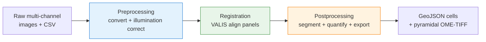

# Usage

Everything you need to run MIRAGE: the three-stage model, the samplesheet, the
command shapes, resuming from checkpoints, where outputs land, and the most common
fixes. For the full flag surface see [Parameters](parameters.md); to install see
[Installation](installation.md).

## The three-stage model

MIRAGE runs in **three stages, always in this order**. You choose where to enter
and exit with `--start` and `--stop` (both accept `preprocessing`, `registration`,
or `postprocessing`). A stage runs only when it falls within the `--start … --stop`
window; omit `--stop` to run to the end, and use `--start X --stop X` for exactly
one stage.



- **Preprocessing** — Bio-Formats conversion (DAPI → channel 0) + BaSiC illumination correction.
- **Registration** — VALIS whole-slide alignment of every panel onto the reference panel.
- **Postprocessing** — segmentation + per-cell quantification + QuPath GeoJSON export + pyramidal OME-TIFF.

!!! info "Downstream phenotyping"
    MIRAGE does not assign cell types — the exported GeoJSON carries **raw
    marker intensities**, so you can gate and phenotype downstream in QuPath or
    [FlowPath](https://flowpath.readthedocs.io/).

!!! tip "Adding a new imaging cycle later?"
    To fold a fresh cyclic-IF cycle into an already-completed run — reusing the prior
    reference, segmentation mask, and old-marker quantification — use
    `--mode add_cycle` instead of the linear stages. See [Incremental cycles](add_cycle.md).

## Quick start (synthetic data)

No real images, no GPU, no HPC — runs on any laptop in ~15 minutes:

```bash
git clone https://github.com/sceriff0/mirage.git && cd mirage
python tests/testdata/generate_complete_testdata.py
nextflow run . -profile test,docker --outdir results
```

## The minimal command

Run the whole pipeline on your own data:

```bash
nextflow run . --input samplesheet.csv --outdir results -profile docker
```

`--input` and `--outdir` are **required**. `-profile` selects execution + container
profiles, comma-combined — e.g. `-profile slurm,singularity` on a cluster or
`-profile test,docker` for the bundled demo.

!!! note "Two kinds of flags"
    Nextflow distinguishes **pipeline parameters** (double dash, `--input`) from
    **Nextflow options** (single dash, `-profile`, `-resume`, `-c`,
    `-params-file`). Both appear on the same command line.

### Runtime flags

| Flag | Kind | Required | Description |
|---|---|:---:|---|
| `--input` | param | yes | Samplesheet CSV. Columns depend on `--start` — see [the samplesheet](#the-samplesheet). |
| `--outdir` | param | yes | Output root directory. Checkpoints are written to `<outdir>/csv/`. |
| `--start` | param | no | Entry stage: `preprocessing` (default), `registration`, `postprocessing`. |
| `--stop` | param | no | Last stage to run. Omitted = run to the end. |
| `--dry_run true` | param | no | Validate inputs and the samplesheet, then exit without running tasks. |
| `-profile` | option | no | Execution/config profiles, comma-combined (e.g. `slurm,singularity`). |
| `-params-file` | option | no | JSON preset of parameters, e.g. `params/full_pipeline.json`. |
| `-resume` | option | no | Reuse cached results from a previous run's `work/`. |
| `-c` | option | no | Layer an extra config file (e.g. site-specific SLURM settings). |

For the complete parameter list see [Parameters](parameters.md).

### Common invocations

=== "Full pipeline"

    ```bash
    nextflow run . --input samplesheet.csv --outdir results \
      --start preprocessing -profile docker \
      -params-file params/full_pipeline.json
    ```

=== "Single stage"

    ```bash
    nextflow run . --input samplesheet.csv --outdir results \
      --start preprocessing --stop preprocessing -profile docker
    ```

=== "Resume at registration"

    ```bash
    nextflow run . --input results/csv/preprocessed.csv --outdir results \
      --start registration -profile docker -resume
    ```

=== "Resume at postprocessing"

    ```bash
    nextflow run . --input results/csv/registered.csv --outdir results \
      --start postprocessing -profile docker -resume
    ```

=== "Dry run"

    ```bash
    nextflow run . --input samplesheet.csv --outdir results \
      --start preprocessing --dry_run true
    ```

## The samplesheet

MIRAGE is driven by a single CSV passed with `--input`. One row per image (one
acquisition panel); rows are grouped by `patient_id`, and each patient is processed
independently and in parallel.

!!! tip "Rules in brief"
    - One row per image; group rows by `patient_id`.
    - Exactly **one** `is_reference=true` row per patient (its coordinate space is
      the registration target).
    - `channels` is pipe-separated, in acquisition order, and **must include DAPI**
      (matched case-insensitively; `CONVERT_IMAGE` moves it to channel 0).
    - The image column depends on `--start`.

The required columns change with the entry point, because each stage consumes a
different kind of image:

| `--start` | Image column | Other required columns | Typical source |
|---|---|---|---|
| `preprocessing` | `path_to_file` | `patient_id`, `is_reference`, `channels` | your raw samplesheet |
| `registration` | `preprocessed_image` | `patient_id`, `is_reference`, `channels` | `<outdir>/csv/preprocessed.csv` |
| `postprocessing` | `registered_image` | `patient_id`, `is_reference`, `channels` | `<outdir>/csv/registered.csv` |

Example raw samplesheet (`--start preprocessing`):

```csv
patient_id,path_to_file,is_reference,channels
P001,/data/raw/P001_panel1.nd2,true,DAPI|CD3|CD8|CD4
P001,/data/raw/P001_panel2.nd2,false,DAPI|PANCK|SMA|VIMENTIN
P002,/data/raw/P002_panel1.czi,true,DAPI|CD3|CD8|CD4
P002,/data/raw/P002_panel2.czi,false,DAPI|FOXP3|KI67|CD20
```

!!! success "You rarely write the later samplesheets by hand"
    Each stage emits the next stage's samplesheet as a checkpoint CSV — see below.

??? tip "Finding channel names from OME metadata"
    ```bash
    showinf -nopix -omexml-only /data/raw/P001_panel1.nd2 | grep -i "Channel"
    ```
    Or in Python: `AICSImage("file.nd2").channel_names`. Join the names with `|`.

## Checkpoints & resuming

Each stage writes one **aggregated checkpoint CSV** (covering all patients) to a
single `csv/` folder directly under `--outdir`. Each doubles as the next stage's
samplesheet — feed it back in with a matching `--start`.

```text
<outdir>/csv/preprocessed.csv     # after preprocessing  → feeds --start registration
<outdir>/csv/registered.csv       # after registration   → feeds --start postprocessing
<outdir>/csv/postprocessed.csv    # after postprocessing  → manifest of final outputs
```

!!! danger "Checkpoints are in `<outdir>/csv/`, NOT `<outdir>/<patient>/csv/`"
    A frequent source of confusion: the resume CSVs are aggregated, one file each,
    directly under `--outdir` — not in the per-patient subtree. Keep `--outdir`
    consistent across stages so resume commands point `--input` at the right file.

!!! note "`-resume` vs `--start` — different mechanisms"
    - `-resume` reuses the **Nextflow work cache** within a run lineage; only
      changed/failed tasks re-run.
    - `--start` **skips earlier stages entirely** by feeding a checkpoint CSV.

    They combine freely, e.g. `--start postprocessing … -resume`.

## Execution profiles

Profiles are defined in `nextflow.config` and combine with commas — pick one
**execution** profile and one **container** profile.

| Profile | Kind | What it does |
|---|---|---|
| `docker` | container | Run processes in Docker (local/dev). |
| `singularity` | container | Run processes in Singularity/Apptainer (recommended on HPC). |
| `conda` | container | Conda-managed environments (no containers). |
| `local` | executor | Local executor with conservative caps (4 CPU / 16 GB). |
| `slurm` | executor | Submit each process as a SLURM job. |
| `ieo` | site | IEO cluster profile (site-specific). |
| `test` / `test_full` | data + caps | Bundled synthetic datasets, small resource caps, CPU segmentation. |
| `instantseg_test` / `cellsam_test` | data + caps | Test profiles exercising those segmentation backends. |

```bash
# Laptop demo
nextflow run . -profile test,docker --outdir results
# HPC production
nextflow run . -profile slurm,singularity --input samplesheet.csv --outdir results
```

JSON presets in `params/` (`full_pipeline.json`, `preprocessing_only.json`,
`registration_only.json`, `postprocessing_only.json`, `test.json`) set sensible
defaults; load one with `-params-file` and override values inline.

## Running on HPC

On a cluster, combine the SLURM executor with Singularity containers:

```bash
nextflow run . -profile slurm,singularity \
  --input samplesheet.csv --outdir results --start preprocessing
```

- **Cache images once** — point `NXF_SINGULARITY_CACHEDIR` (and
  `SINGULARITY_CACHEDIR`) at a shared, writable path so images are pulled once.
- **Scheduler settings** — set `--slurm_partition`, `--slurm_account`,
  `--slurm_qos` (or use a site profile / a `-c site.config`).
- **GPU jobs** — request a GPU with `--gpu_type` matching `sinfo -o "%G"`; the
  request is emitted as `--gres=gpu:<value>` and Singularity passes the device with
  `--nv`. Set `--seg_gpu false` to force CPU.
- **Resource caps** — `--max_memory` (default `700.GB`), `--max_cpus` (`128`),
  `--max_time` (`240.h`) clamp every per-process request; memory/time scale with
  `task.attempt`, so retries automatically ask for more (up to the cap). See the
  [cluster parameters](parameters.md#cluster-resources).

A minimal `site.config` layered with `-c`:

```groovy
params {
    slurm_partition = 'compute'
    slurm_account   = 'myproject'
    max_memory      = '500.GB'
    max_cpus        = 64
    max_time        = '120.h'
}
```

## Outputs

Two output locations: per-patient **results** under `--outdir`, and aggregated
**checkpoints** under `<outdir>/csv/` (above).

```text
results/                          # = --outdir
├── <patient_id>/
│   ├── converted/                # standardized OME-TIFF (DAPI → ch0)
│   ├── preprocessed/             # *_corrected.ome.tif (BaSiC)
│   ├── registered/               # *_registered.ome.tiff (+ summary/ error CSVs)
│   ├── segmentation/             # *_nuclei_mask.tif, *_cell_mask.tif
│   ├── cell_properties/          # morphology.csv, contours.json
│   ├── quantification/           # merged_quant.csv
│   ├── geojson/                  # cells.geojson, cells_data.csv
│   ├── pyramid/                  # *.ome.tiff (multi-resolution)
│   └── qc/                       # preprocess / registration / postprocessing QC
├── csv/                          # checkpoint CSVs (all patients)
└── qc/                           # aggregated HTML QC report
    └── segmentation/             # segmentation_metrics.csv (CSE quality scores, all patients)
```

The tables you'll analyze:

| File | What it is |
|---|---|
| `quantification/merged_quant.csv` | One row per cell; all markers (mean intensity) + morphology joined. With `--quantify_compartments`, adds `<MARKER>: Nucleus/Cytoplasm/Cell: Mean`; with `--expanded_quantification`, also Median and Sum. |
| `geojson/cells.geojson` | One QuPath feature per cell: whole-cell polygon + measurement array (centroid µm, marker intensities, morphology). Carries `nucleusGeometry` in compartment mode. |
| `geojson/cells_data.csv` | The cell table with per-marker **z-scores** added. |
| `segmentation/*_cell_mask.tif` | Whole-cell instance labels (uint32); each non-zero value is one cell. |
| `qc/segmentation/segmentation_metrics.csv` | Reference-free segmentation-quality score (CellSegmentationEvaluator) per patient. Skip with `--skip_seg_quality_eval`. |

These open directly in QuPath, napari, and OMERO, and feed
[FlowPath](https://flowpath.readthedocs.io/) for interactive gating.

## Troubleshooting & FAQ

??? question "Which segmentation backend should I use?"
    Pick with `--seg_method`: **`stardist`** (default; robust, needs DAPI at
    channel 0 — guaranteed upstream), **`instantseg`** (channel-invariant; tune
    batch/tile size for GPU memory), **`cellsam`** (finds DAPI by name; needs a
    weight download via `DEEPCELL_ACCESS_TOKEN`, or a local `--cellsam_model_path`).

??? failure "Launch fails on an invalid value"
    `--start`/`--stop` must be `preprocessing|registration|postprocessing`;
    `--registration_method` must be `valis|tiled`; `--seg_method` must be
    `stardist|instantseg|cellsam`. Typos exit before any process is submitted.

??? failure "`--input` validation error / wrong columns"
    The most common mistake is feeding the **preprocessing** samplesheet to
    `--start registration`. Each stage needs its own column (`path_to_file` →
    `preprocessed_image` → `registered_image`). Feed the checkpoint CSV that
    matches the stage you're resuming.

??? failure "Out-of-memory / exit code 137 or 140"
    Almost always the job exceeded its memory/time grant. Raise `--max_memory`,
    `--max_cpus`, `--max_time`; MIRAGE auto-retries on `104,134,135,137,139,140,143`
    with scaled resources. For registration specifically, drop to
    `--memory_mode low` and lower `--reg_max_image_dim` (and `--feature_n_features`
    if feature detection is the culprit).

??? failure "The run seems to hang at startup"
    Usually Nextflow pulling large container images on first run. Pre-pull once:
    `docker pull cdgatenbee/valis-wsi:1.0.0` (and the `bolt3x/attend_image_analysis`
    tag pinned in `conf/modules.config`), or the `singularity pull` equivalents.

??? failure "Singularity: `FATAL: ... permission denied`"
    The cache isn't writable. Point it at a path you own:
    ```bash
    export NXF_SINGULARITY_CACHEDIR=$HOME/.singularity_cache
    export SINGULARITY_CACHEDIR=$HOME/.singularity_cache
    ```

??? failure "`--expanded_quantification requires --quantify_compartments`"
    Expanded output depends on compartments. Either add `--quantify_compartments`,
    or drop `--expanded_quantification` for a flat per-cell table.

??? question "Do I need a GPU?"
    No — run CPU-only with `--seg_gpu false`. A GPU mainly accelerates `SEGMENT`.

??? tip "Resetting a stuck task"
    If `-resume` keeps re-running the same failing task after you've fixed params,
    clear just that task's cache by hash (shown in the error): `rm -rf work/<hash>*`
    then resume. Avoid `rm -rf work/` wholesale.

Still stuck? Open an issue with your command line, the relevant `.nextflow.log`
excerpt, and the failing task's `.command.log` on the
[GitHub tracker](https://github.com/sceriff0/mirage/issues).
